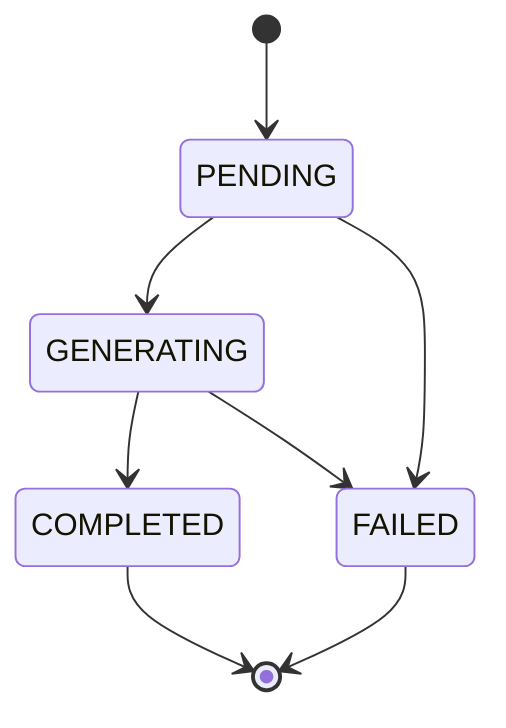

# AI 생성 및 운영 흐름

[MVP 사용자 흐름](user-flow.md)의 경험 구조화와 자기소개서 문항별 초안 생성 내부 처리를 정의합니다. 현재 런타임은 Spring AI를 통해 OpenAI를 항상 호출합니다.

## 1. 경험 구조화

```text
자연어 경험 입력
→ OpenAI Structured Outputs 정상 1회
→ STAR와 표준 키워드 미리보기
→ 사용자 확인·수정
→ EXPERIENCE와 EXPERIENCE_KEYWORD 저장
```

경험 구조화 API는 미리보기만 반환하며 DB에 저장하지 않습니다. 사용자가 확인한 결과를 별도 저장 API로 보낼 때만 저장합니다. 새로고침 등으로 프론트엔드 상태를 잃으면 미리보기도 사라지는 것을 현재 범위에서 허용합니다.

## 2. 문항별 새 초안 생성

```text
PENDING 초안 생성
→ GENERATING 전환
→ 문항·공고·기업 정보·경험 후보로 OpenAI Structured Outputs 호출
→ 호출 내부에서 문항 유형·경험 적합도 판단, 본문 작성, 자체 점검
→ 구조화 응답의 ID·분량·숫자 근거 검증
→ 사용 경험·기업 정보 스냅샷과 본문 저장
→ COMPLETED 전환
```

- 문항은 한 번에 하나씩 생성합니다.
- 내부 자체 점검은 별도 LLM 호출이 아니며 점수나 피드백을 저장하지 않습니다.
- 문항 사전 분석 결과를 별도 저장하지 않습니다.
- 새 요청은 항상 새 `COVER_LETTER_DRAFT`를 만들며 이전 초안을 덮어쓰지 않습니다.
- LLM이 반환한 경험 ID는 현재 사용자 소유인지 확인합니다.
- 기업 정보 ID는 지원 기업의 정보인지 확인합니다.
- 구조화 응답 오류나 글자 수 검증 실패에 제한된 재시도를 적용하면 실제 LLM 호출 수는 늘어날 수 있습니다.

## 3. 경험 후보 선택 정책

MVP는 현재 사용자의 저장 경험 전체를 한 번의 생성 호출에 후보로 전달합니다. 같은 호출에서 문항과 공고를 분석해 핵심 경험 1개를 선택하고, 문항에 꼭 필요할 때만 연결 가능한 보조 경험 1개를 추가합니다.

```text
저장 경험 전체
→ 문항·공고와 함께 LLM 1회 호출
→ 실제 사용 경험 1~2개와 본문 반환
→ 반환 ID를 전달 후보와 대조
→ 실제 사용 경험만 DRAFT_EXPERIENCE에 저장
```

별도 경험 선별 호출과 고정 키워드 점수 알고리즘은 현재 범위에 포함하지 않습니다. 경험 수 증가로 모델 입력 한도가 문제가 될 때 2단계 선택 정책을 후속 도입합니다.

## 4. 초안 상태



| 상태 | 의미 |
|---|---|
| `PENDING` | 생성 요청을 접수하고 처리를 기다리는 상태 |
| `GENERATING` | LLM을 호출하거나 결과를 저장 중인 상태 |
| `COMPLETED` | 본문과 생성 근거 저장 완료 |
| `FAILED` | 생성·검증 중 실패 |

규칙:

- `COMPLETED`에는 `content`와 `finished_at`이 필요합니다.
- `FAILED`에는 안전한 `error_code`, `error_message`, `finished_at`을 기록합니다.
- 실패 행을 다시 `GENERATING`으로 바꾸지 않습니다.
- 동일 문항에 `PENDING` 또는 `GENERATING` 초안이 있으면 새 요청을 `409`로 차단합니다.
- 서로 다른 문항은 동시에 생성할 수 있습니다. 현재 `TaskExecutor`는 core 2, max 4, queue 20으로 구성합니다.
- `draft_no`는 문항 행 잠금 또는 고유 제약 충돌 재시도로 할당합니다.

## 5. 클라이언트 Polling

- 초안 생성 API는 `202 Accepted`, `draftId`, `statusUrl`을 반환합니다.
- 프론트엔드는 약 1초 간격으로 상태 URL을 조회합니다.
- `COMPLETED` 또는 `FAILED`에서 Polling을 중단합니다.
- 화면의 30초 타임아웃은 서버 작업 취소를 의미하지 않습니다.
- SSE 스트리밍과 전체 문항 생성 상태 집계는 현재 범위에 포함하지 않습니다.

## 6. 생성 근거 보존

| 근거 | 보존 위치 | 원본 삭제 시 처리 |
|---|---|---|
| 공고 상세 | `JOB_APPLICATION.posting_snapshot` | 프로젝트와 함께 유지 |
| 문항 | `COVER_LETTER_ITEM` | 프로젝트와 함께 유지 |
| 경험 | `DRAFT_EXPERIENCE.used_experience_json` | `experience_id`만 NULL |
| 기업 정보 | `DRAFT_COMPANY_INFO_SNAPSHOT` | `company_info_id`만 NULL |

완전한 LLM 재현을 목표로 하지는 않습니다. 호출별 모델·프롬프트 버전·토큰·지연 시간은 `LLM_CALL_LOG`에 저장하지만 프롬프트 원문, 전체 후보 입력과 응답 원문은 저장하지 않습니다.

## 7. 초안 선택과 수정

- 첫 성공 초안은 선택값이 없을 때만 자동 선택할 수 있습니다.
- 새 초안을 생성해도 기존 `selected_draft_id`는 자동으로 바꾸지 않습니다.
- 선택 API는 초안이 동일 문항 소속이고 `COMPLETED`인지 검증합니다.
- 사용자 수정본은 초안별 최신 한 건만 유지하며 저장 버튼을 눌렀을 때만 갱신합니다.
- 최종 표시 본문은 수정본이 있으면 수정본, 없으면 AI 초안입니다.
- 새 초안을 선택하거나 선택 초안을 수정하면 문항과 지원 프로젝트를 `DRAFTING`으로 돌립니다.

## 8. 지원 프로젝트 상태

```text
모든 문항 REVIEWED → JOB_APPLICATION.REVIEWED
하나 이상 DRAFTING → JOB_APPLICATION.DRAFTING
```

생성 중 화면 상태는 `COVER_LETTER_DRAFT.generation_status`로 판단합니다. 지원 프로젝트 상태는 클라이언트가 직접 변경하지 않고 서버가 문항 상태로 계산·갱신합니다.

## 9. 권한 검증 경로

```text
EXPERIENCE → user_id
RECOMMENDATION_RUN → user_id
RECOMMENDATION_ITEM → RECOMMENDATION_RUN.user_id
JOB_APPLICATION → user_id
COVER_LETTER_ITEM → JOB_APPLICATION.user_id
COVER_LETTER_DRAFT → COVER_LETTER_ITEM → JOB_APPLICATION.user_id
COVER_LETTER_EDIT → COVER_LETTER_DRAFT → JOB_APPLICATION.user_id
```

반드시 차단할 동작:

1. 다른 사용자의 경험을 추천 또는 초안 생성에 사용
2. 다른 사용자의 추천 결과를 지원 프로젝트의 출발점으로 지정
3. 추천 결과와 다른 공고 ID로 프로젝트 생성
4. 지원 기업과 관계없는 기업 정보를 초안에 사용
5. 다른 문항의 초안을 선택 초안으로 지정
6. LLM이 임의 생성한 존재하지 않는 ID 저장

존재하지만 다른 사용자 소유인 리소스는 정보 노출 방지를 위해 `404`로 응답할 수 있습니다.

## 10. 트랜잭션 경계

다음 작업은 각각 하나의 짧은 DB 트랜잭션으로 처리합니다.

- 경험과 경험 키워드 생성·수정
- 추천 실행의 `PROCESSING` 생성
- 추천 입력 경험과 결과 저장 및 `COMPLETED` 전환
- 지원 프로젝트와 전체 문항 생성
- `PENDING` 초안 생성과 `draft_no` 할당
- LLM 성공 결과와 경험·기업 정보 스냅샷 저장
- 사용자 수정본 upsert
- 초안 선택과 문항·프로젝트 상태 갱신

추천 제공자, 공고 제공자, LLM 호출 중에는 DB 트랜잭션을 열어두지 않습니다.

## 11. 미니프로젝트 운영 한계

Spring 애플리케이션 내부 비동기 처리만 사용하면 서버 재시작 순간의 작업을 이어서 실행할 수 없습니다. 현재 구현은 시작 시 남아 있는 `PENDING` 또는 `GENERATING` 초안을 `FAILED(DRAFT_INTERRUPTED)`로 전환해 무한 Polling을 막고, 사용자가 새 초안을 요청하도록 안내합니다. 운영 서비스로 확장할 때 재개 가능한 작업 큐와 별도 작업 관리 구조를 검토합니다.
