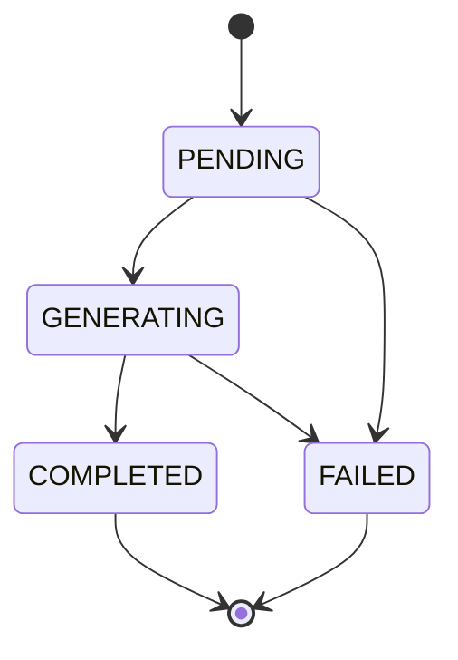

# AI 생성 및 운영 흐름

## 1. 경험 구조화

```text
자연어 경험 입력
→ LLM 1회
→ STAR와 표준 키워드 미리보기
→ 사용자 확인·수정
→ EXPERIENCE와 EXPERIENCE_KEYWORD 저장
```

경험 구조화는 동기식 미리보기 API로 처리하고 구조화 API 자체에서는 DB에 저장하지 않습니다.

## 2. 단일 문항 초안 생성

```text
PENDING 초안 생성
→ GENERATING 전환
→ 문항 요구사항 분석 + 경험 선택 + 기업 정보 선택 + 본문 생성 LLM 1회
→ LLM 반환 ID 검증
→ 요구사항 최초 저장
→ 경험·기업 정보 스냅샷과 본문 저장
→ COMPLETED 전환
```

- 요구사항이 이미 있으면 다시 분석하지 않고 기존 값을 사용합니다.
- 구조화 응답 오류나 글자 수 검증 실패에 제한된 재시도를 적용하면 실제 호출은 추가될 수 있습니다.
- LLM이 반환한 경험 ID는 현재 사용자 소유인지 확인합니다.
- 기업 정보 ID는 지원 기업의 정보인지 확인합니다.

## 3. 전체 문항 초안 생성

문항 수가 N개라면 정상 기준 `N+1회` 호출합니다.

```text
동일 generation_group_id로 PENDING 초안 N개 생성
→ 전체 문항 요구사항 분석과 경험·기업 정보 배치 계획 1회
→ 문항별 초안 생성 N회
→ 각 초안을 독립적으로 COMPLETED 또는 FAILED 처리
```

사전 계획은 다음 목적을 가집니다.

- 모든 문항에 같은 경험이 반복되는 현상 완화
- 문항별 서로 다른 역량 배치
- 지원서 전체의 강조 전략 정합성 확보
- 문항별 사용할 기업 정보와 작성 방향 결정

전체 계획 호출이 실패하면 같은 그룹의 모든 `PENDING` 초안을 `FAILED`로 변경합니다. 재시도는 기존 초안을 되돌리지 않고 새로운 그룹과 새 초안으로 수행합니다.

## 4. 초안 상태



| 상태 | 의미 |
|---|---|
| `PENDING` | 생성 요청을 접수하고 처리를 기다리는 상태 |
| `GENERATING` | LLM을 호출하거나 결과를 저장 중인 상태 |
| `COMPLETED` | 본문과 생성 근거 저장 완료 |
| `FAILED` | 계획·생성·검증 중 실패 |

규칙:

- `COMPLETED`에는 `content`와 `finished_at`이 필요합니다.
- `FAILED`에는 안전한 `error_code`, `error_message`, `finished_at`을 기록합니다.
- 실패 행을 다시 `GENERATING`으로 바꾸지 않습니다.
- 동일 문항에 `PENDING` 또는 `GENERATING` 초안이 있으면 새 단일 요청을 `409`로 차단합니다.
- `draft_no`는 문항 행 잠금 또는 고유 제약 충돌 재시도로 할당합니다.

## 5. 전체 생성 상태 집계

별도 `AI_JOB` 테이블 없이 같은 `generation_group_id`를 가진 초안 상태를 집계합니다.

```text
모두 PENDING                                      → PENDING
PENDING 또는 GENERATING이 하나라도 존재           → IN_PROGRESS
미완료 없이 모두 COMPLETED                        → COMPLETED
미완료 없이 COMPLETED와 FAILED가 함께 존재         → PARTIAL_FAILED
미완료 없이 모두 FAILED                           → FAILED
```

`generation_group_id`에는 조회 인덱스를 둡니다.

## 6. 문항 요구사항 관리

`COVER_LETTER_REQUIREMENT`는 다음 흐름의 중간 결과를 영속화합니다.

```text
문항
→ 요구 역량·특성·평가 의도 추출
→ EXPERIENCE_KEYWORD와 논리적 매칭
→ 경험 선택
```

- 단일 문항 생성에서는 요구사항이 없을 때 생성 응답에서 함께 추출합니다.
- 전체 생성에서는 계획 호출에서 요구사항이 없는 문항만 분석합니다.
- 문항은 스냅샷으로 고정되므로 이후 초안에서는 요구사항을 재사용합니다.
- 이번 범위에서는 요구사항 재분석 API와 분석 버전을 두지 않습니다.

## 7. 생성 근거 보존

| 근거 | 보존 위치 | 원본 삭제 시 처리 |
|---|---|---|
| 공고 상세 | `JOB_APPLICATION.posting_snapshot` | 지원서와 함께 유지 |
| 문항 | `COVER_LETTER_ITEM` | 지원서와 함께 유지 |
| 문항 분석 | `COVER_LETTER_REQUIREMENT` | 문항과 함께 유지 |
| 경험 | `DRAFT_EXPERIENCE.used_experience_json` | `experience_id`만 NULL |
| 기업 정보 | `DRAFT_COMPANY_INFO_SNAPSHOT` | `company_info_id`만 NULL |

완전한 LLM 재현을 목표로 하지는 않습니다. 전체 후보 목록, 프롬프트 원문, 모델 버전은 현재 범위에서 저장하지 않습니다.

## 8. 초안 선택과 수정

- 첫 성공 초안은 선택값이 없을 때만 자동 선택할 수 있습니다.
- 새 초안을 생성해도 기존 `selected_draft_id`는 자동으로 바꾸지 않습니다.
- 선택 API는 초안이 동일 문항 소속이고 `COMPLETED`인지 검증합니다.
- 사용자 수정본은 초안별 최신 한 건만 유지합니다.
- 최종 표시 본문은 수정본이 있으면 수정본, 없으면 AI 초안입니다.
- 새 초안을 선택하거나 선택 초안을 수정하면 문항과 지원서를 `DRAFTING`으로 돌립니다.

## 9. 지원서 상태

```text
모든 문항 REVIEWED → JOB_APPLICATION.REVIEWED
하나 이상 DRAFTING → JOB_APPLICATION.DRAFTING
```

지원서 상태는 클라이언트가 직접 변경하지 않고 서버가 문항 상태로 계산·갱신합니다.

## 10. 권한 검증 경로

```text
EXPERIENCE → user_id
RECOMMENDATION → user_id
JOB_APPLICATION → user_id
COVER_LETTER_ITEM → JOB_APPLICATION.user_id
COVER_LETTER_DRAFT → COVER_LETTER_ITEM → JOB_APPLICATION.user_id
COVER_LETTER_EDIT → COVER_LETTER_DRAFT → JOB_APPLICATION.user_id
```

반드시 차단할 동작:

1. 다른 사용자의 경험을 초안 생성에 전달
2. 다른 사용자의 추천으로 지원서 생성
3. 지원 기업과 관계없는 기업 정보를 초안에 사용
4. 다른 문항의 초안을 선택 초안으로 지정
5. LLM이 임의 생성한 존재하지 않는 ID 저장

존재하지만 다른 사용자 소유인 리소스는 정보 노출 방지를 위해 `404`로 응답할 수 있습니다.

## 11. 트랜잭션 경계

다음 작업은 각각 하나의 짧은 DB 트랜잭션으로 처리합니다.

- 사용자 선호 산업·직무·기술 전체 교체
- 경험과 경험 키워드 생성·수정
- 지원서와 전체 문항 생성
- `PENDING` 초안 생성과 `draft_no` 할당
- LLM 성공 결과, 요구사항, 경험·기업 정보 스냅샷 저장
- 사용자 수정본 upsert
- 초안 선택과 문항·지원서 상태 갱신

외부 공고 조회와 LLM 호출 중에는 DB 트랜잭션을 열어두지 않습니다. 전체 문항 생성도 일부 성공과 일부 실패가 가능하므로 하나의 장기 트랜잭션으로 묶지 않습니다.

## 12. 미니프로젝트 운영 한계

Spring 애플리케이션 내부 비동기 처리만 사용하면 서버 재시작 시 `PENDING` 또는 `GENERATING` 상태가 남을 수 있습니다.

MVP에서는 일정 시간 이상 멈춘 초안을 `FAILED`로 전환하고 사용자가 새 초안을 요청하도록 처리합니다. 운영 서비스로 확장할 때 작업 큐와 별도 작업 관리 구조를 검토합니다.
