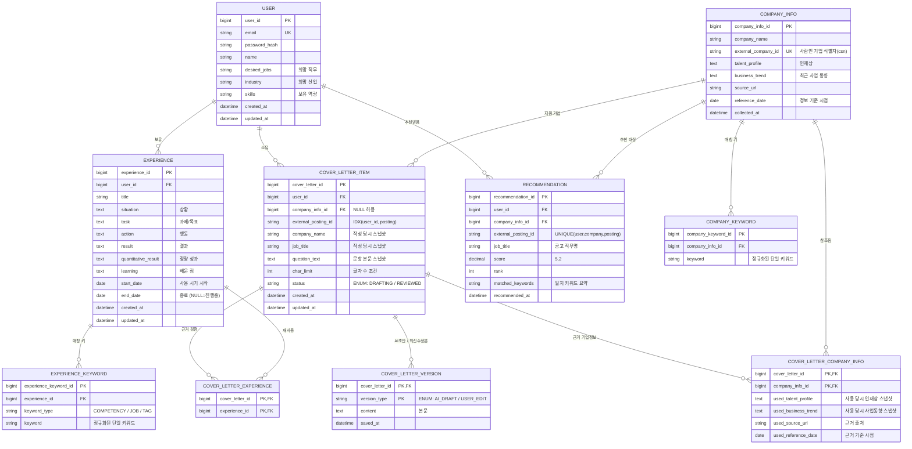

# 🗄️ Database Architecture (Overall ERD)

경험 기반 기업·직무 추천 및 AI 자기소개서 작성 지원 서비스의 통합 데이터 모델 ERD

---

## 1. 전체 도메인 ERD

```mermaid
erDiagram
    USER ||--o{ EXPERIENCE : "보유"
    USER ||--o{ COVER_LETTER_ITEM : "소유"
    USER ||--o{ RECOMMENDATION : "추천받음"
    COMPANY_INFO ||--o{ COVER_LETTER_ITEM : "지원 기업"
    COMPANY_INFO ||--o{ RECOMMENDATION : "추천 대상"
    EXPERIENCE ||--o{ EXPERIENCE_KEYWORD : "매칭 키"
    COMPANY_INFO ||--o{ COMPANY_KEYWORD : "매칭 키"
    COVER_LETTER_ITEM ||--o{ COVER_LETTER_VERSION : "AI초안 / 최신수정본"
    COVER_LETTER_ITEM ||--o{ COVER_LETTER_EXPERIENCE : "근거 경험"
    EXPERIENCE ||--o{ COVER_LETTER_EXPERIENCE : "재사용"
    COVER_LETTER_ITEM ||--o{ COVER_LETTER_COMPANY_INFO : "근거 기업정보"
    COMPANY_INFO ||--o{ COVER_LETTER_COMPANY_INFO : "참조됨"

    USER {
        bigint user_id PK
        string email UK
        string password_hash
        string name
        string desired_jobs "희망 직무"
        string industry "희망 산업"
        string skills "보유 역량"
        datetime created_at
        datetime updated_at
    }

    EXPERIENCE {
        bigint experience_id PK
        bigint user_id FK
        string title
        text situation "상황"
        text task "과제/목표"
        text action "행동"
        text result "결과"
        text quantitative_result "정량 성과"
        text learning "배운 점"
        date start_date "사용 시기 시작"
        date end_date "종료 (NULL=진행중)"
        datetime created_at
        datetime updated_at
    }

    EXPERIENCE_KEYWORD {
        bigint experience_keyword_id PK
        bigint experience_id FK
        string keyword_type "COMPETENCY / JOB / TAG"
        string keyword "정규화된 단일 키워드"
    }

    COMPANY_INFO {
        bigint company_info_id PK
        string company_name
        string external_company_id UK "사람인 기업 식별자(csn)"
        text talent_profile "인재상"
        text business_trend "최근 사업 동향"
        string source_url
        date reference_date "정보 기준 시점"
        datetime collected_at
    }

    COMPANY_KEYWORD {
        bigint company_keyword_id PK
        bigint company_info_id FK
        string keyword "정규화된 단일 키워드"
    }

    RECOMMENDATION {
        bigint recommendation_id PK
        bigint user_id FK
        bigint company_info_id FK
        string external_posting_id "UNIQUE(user,company,posting)"
        string job_title "공고 직무명"
        decimal score "5,2"
        int rank
        string matched_keywords "일치 키워드 요약"
        datetime recommended_at
    }

    COVER_LETTER_ITEM {
        bigint cover_letter_id PK
        bigint user_id FK
        bigint company_info_id FK "NULL 허용"
        string external_posting_id "IDX(user_id, posting)"
        string company_name "작성 당시 스냅샷"
        string job_title "작성 당시 스냅샷"
        text question_text "문항 본문 스냅샷"
        int char_limit "글자 수 조건"
        string status "ENUM: DRAFTING / REVIEWED"
        datetime created_at
        datetime updated_at
    }

    COVER_LETTER_VERSION {
        bigint cover_letter_id PK,FK
        string version_type PK "ENUM: AI_DRAFT / USER_EDIT"
        text content "본문"
        datetime saved_at
    }

    COVER_LETTER_EXPERIENCE {
        bigint cover_letter_id PK,FK
        bigint experience_id PK,FK
    }

    COVER_LETTER_COMPANY_INFO {
        bigint cover_letter_id PK,FK
        bigint company_info_id PK,FK
        text used_talent_profile "사용 당시 인재상 스냅샷"
        text used_business_trend "사용 당시 사업동향 스냅샷"
        string used_source_url "근거 출처"
        date used_reference_date "근거 기준 시점"
    }
```
