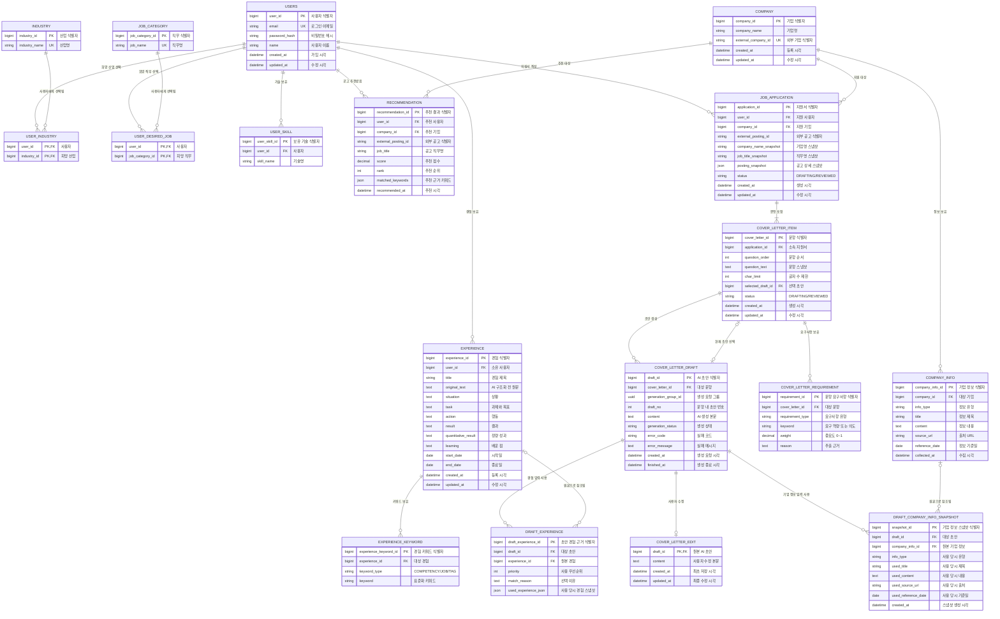
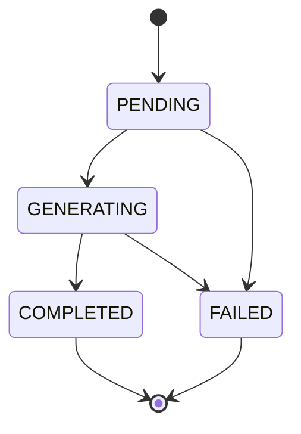

# 매니패스트 자기소개서 지원 서비스 ERD 및 API 명세

| 항목 | 내용 |
|---|---|
| 문서 상태 | 팀 공유용 설계안 |
| 버전 | 1.0 |
| 작성 기준일 | 2026-09-03 |
| API 기준 경로 | `/api/v1` |

## 1. 문서 목적

이 문서는 사용자 경험을 STAR 형식으로 구조화하고, 추천 공고와 기업 정보를 바탕으로 자기소개서 문항별 AI 초안을 생성·수정하는 서비스의 데이터 모델과 API 계약을 정의한다.

핵심 사용자 흐름은 다음과 같다.

```text
회원가입 및 선호 정보 등록
→ 경험 입력 및 AI 구조화
→ 추천 공고 조회
→ 공고별 지원서와 문항 생성
→ 문항 요구사항 분석
→ 경험 및 기업 정보 선택
→ AI 초안 생성
→ 초안 선택 및 사용자 수정
```

## 2. 범위와 설계 가정

1. 추천 공고는 외부 제휴 플랫폼의 추천 로직으로 선별된 결과를 목데이터로 제공받는다고 가정한다.
2. 모든 외부 기업·공고 식별자는 하나의 채용 플랫폼 기준이므로 이번 범위에서는 `provider` 컬럼을 두지 않는다.
3. 채용공고 전체를 자체 DB의 마스터 데이터로 구축하지 않는다.
4. 추천 공고 상세 조회 시 외부 API 또는 목데이터 어댑터에서 담당 업무, 자격요건, 우대사항, 자기소개서 문항을 가져온다.
5. 사용자가 공고를 선택하면 이후 외부 공고가 변경·삭제되어도 작성할 수 있도록 공고와 문항을 스냅샷으로 저장한다.
6. 기업 인재상·핵심가치·최근 동향은 자체 `COMPANY_INFO`에 유형별 항목으로 저장한다.
7. `COMPANY_KEYWORD`, `JOB_POSTING`, `AI_JOB` 테이블은 현재 범위에서 사용하지 않는다.
8. AI 초안은 덮어쓰지 않는다. 새 초안 요청마다 새로운 `COVER_LETTER_DRAFT`를 만든다.
9. AI 초안별 사용자 수정본은 최신 한 건만 저장한다. 수정 이력 전체는 현재 범위에 포함하지 않는다.
10. 사용자당 동일 외부 공고의 지원서는 한 건만 허용한다.

## 3. 주요 설계 결정

### 3.1 문항 요구사항을 명시적으로 저장한다

피드백의 핵심 보완사항으로 `COVER_LETTER_REQUIREMENT`를 설계에 포함한다. 이 테이블은 문항 분석 결과를 보관한다.

```text
문항
→ 문항 요구사항 및 평가 의도 추출
→ 경험 키워드와 매칭
→ 사용할 경험 선택
→ 초안 생성
```

문항 요구사항과 경험 키워드는 문자열 기반의 논리적 매칭 대상이며 직접 FK로 연결하지 않는다.

문항 요구사항 분석은 독립적인 사용자 API로 노출하지 않는다. 첫 초안 생성 시 요구사항이 없으면 단일 문항 생성 LLM 응답에서 함께 추출해 최초 저장하고, 전체 문항 생성에서는 사전 계획 LLM 응답에서 요구사항이 없는 문항만 최초 저장한다. 문항 스냅샷은 변경되지 않으므로 이후 초안 생성에서는 저장된 요구사항을 그대로 재사용하며, 이번 범위에서는 요구사항 재분석·교체 기능을 제공하지 않는다.

### 3.2 초안에 최종 반영된 핵심 근거를 보존한다

AI 초안 생성 당시 선택되어 최종 반영된 핵심 근거를 다음과 같이 보존한다. 전체 후보 목록, 프롬프트 원문, 모델 버전까지 완전히 재현하는 범위는 포함하지 않는다.

| 입력·결과 | 저장 위치 |
|---|---|
| 공고 상세 | `JOB_APPLICATION.posting_snapshot` |
| 문항 | `COVER_LETTER_ITEM` |
| 문항 요구사항 | `COVER_LETTER_REQUIREMENT` |
| 사용 경험 | `DRAFT_EXPERIENCE.used_experience_json` |
| 사용 기업 정보 | `DRAFT_COMPANY_INFO_SNAPSHOT` |
| AI 결과 | `COVER_LETTER_DRAFT.content` |
| 사용자 수정 | `COVER_LETTER_EDIT.content` |

### 3.3 초안 선택 무결성

`COVER_LETTER_ITEM.selected_draft_id`는 현재 선택 초안을 빠르게 조회하기 위한 참조다.

- FK 삭제 정책은 `ON DELETE SET NULL`로 한다.
- 선택 초안은 반드시 같은 `cover_letter_id`에 속해야 한다.
- 선택 초안은 `COMPLETED` 상태여야 한다.
- 단순 FK만으로 동일 문항 소속을 완전히 보장하기 어려우므로 서비스 계층에서 검증한다.

### 3.4 전체 생성 상태

별도 `AI_JOB` 대신 `COVER_LETTER_DRAFT.generation_status`를 사용한다. 한 번의 전체 문항 생성 요청으로 만들어진 초안은 동일한 `generation_group_id`를 가진다.

## 4. 전체 ERD



### 4.1 관계 및 카디널리티

| 부모 | 자식 | 관계 | FK 및 삭제 정책 |
|---|---|---|---|
| `USERS` | `USER_INDUSTRY` | 1:N | `user_id`, 사용자 삭제 시 CASCADE |
| `INDUSTRY` | `USER_INDUSTRY` | 1:N | `industry_id`, 사용 중 삭제 제한 |
| `USERS` | `USER_DESIRED_JOB` | 1:N | `user_id`, 사용자 삭제 시 CASCADE |
| `JOB_CATEGORY` | `USER_DESIRED_JOB` | 1:N | `job_category_id`, 사용 중 삭제 제한 |
| `USERS` | `USER_SKILL` | 1:N | `user_id`, 사용자 삭제 시 CASCADE |
| `USERS` | `EXPERIENCE` | 1:N | `user_id`, 사용자 삭제 시 CASCADE |
| `EXPERIENCE` | `EXPERIENCE_KEYWORD` | 1:N | `experience_id`, 경험 삭제 시 CASCADE |
| `COMPANY` | `COMPANY_INFO` | 1:N | `company_id`, 기업 삭제 시 CASCADE 또는 삭제 제한 |
| `USERS` | `RECOMMENDATION` | 1:N | `user_id`, 사용자 삭제 시 CASCADE |
| `COMPANY` | `RECOMMENDATION` | 1:N | `company_id`, 참조 중 삭제 제한 |
| `USERS` | `JOB_APPLICATION` | 1:N | `user_id`, 사용자 삭제 시 CASCADE |
| `COMPANY` | `JOB_APPLICATION` | 1:N | `company_id`, 참조 중 삭제 제한 |
| `JOB_APPLICATION` | `COVER_LETTER_ITEM` | 1:N | `application_id`, 지원서 삭제 시 CASCADE |
| `COVER_LETTER_ITEM` | `COVER_LETTER_REQUIREMENT` | 1:N | `cover_letter_id`, 문항 삭제 시 CASCADE |
| `COVER_LETTER_ITEM` | `COVER_LETTER_DRAFT` | 1:N | `cover_letter_id`, 문항 삭제 시 CASCADE |
| `COVER_LETTER_ITEM` | 선택된 `COVER_LETTER_DRAFT` | 0..1:0..1 | `selected_draft_id`, 초안 삭제 시 SET NULL 및 동일 문항 서비스 검증 |
| `COVER_LETTER_DRAFT` | `COVER_LETTER_EDIT` | 1:0..1 | `draft_id`, 초안 삭제 시 CASCADE |
| `COVER_LETTER_DRAFT` | `DRAFT_EXPERIENCE` | 1:N | `draft_id`, 초안 삭제 시 CASCADE |
| `EXPERIENCE` | `DRAFT_EXPERIENCE` | 1:N | `experience_id`, 경험 삭제 시 SET NULL |
| `COVER_LETTER_DRAFT` | `DRAFT_COMPANY_INFO_SNAPSHOT` | 1:N | `draft_id`, 초안 삭제 시 CASCADE |
| `COMPANY_INFO` | `DRAFT_COMPANY_INFO_SNAPSHOT` | 1:N | `company_info_id`, 원본 삭제 시 SET NULL |

## 5. 테이블 명세

### 5.1 사용자와 선호 정보

#### USERS — 회원 계정

| 컬럼 | 타입 | 제약 | 용도 |
|---|---|---|---|
| `user_id` | BIGINT | PK | 사용자 식별자 |
| `email` | VARCHAR(255) | NOT NULL, UNIQUE | 로그인 이메일 |
| `password_hash` | VARCHAR(255) | NOT NULL | 비밀번호 해시 |
| `name` | VARCHAR(100) | NOT NULL | 사용자 이름 |
| `created_at` | TIMESTAMP | NOT NULL | 가입 시각 |
| `updated_at` | TIMESTAMP | NOT NULL | 수정 시각 |

#### INDUSTRY — 산업 기준 정보

| 컬럼 | 타입 | 제약 | 용도 |
|---|---|---|---|
| `industry_id` | BIGINT | PK | 산업 식별자 |
| `industry_name` | VARCHAR(100) | NOT NULL, UNIQUE | 산업명 |

#### USER_INDUSTRY — 사용자 희망 산업

| 컬럼 | 타입 | 제약 | 용도 |
|---|---|---|---|
| `user_id` | BIGINT | PK, FK | 사용자 |
| `industry_id` | BIGINT | PK, FK | 희망 산업 |

#### JOB_CATEGORY — 직무 기준 정보

| 컬럼 | 타입 | 제약 | 용도 |
|---|---|---|---|
| `job_category_id` | BIGINT | PK | 직무 식별자 |
| `job_name` | VARCHAR(100) | NOT NULL, UNIQUE | 직무명 |

#### USER_DESIRED_JOB — 사용자 희망 직무

| 컬럼 | 타입 | 제약 | 용도 |
|---|---|---|---|
| `user_id` | BIGINT | PK, FK | 사용자 |
| `job_category_id` | BIGINT | PK, FK | 희망 직무 |

#### USER_SKILL — 사용자 보유 기술

| 컬럼 | 타입 | 제약 | 용도 |
|---|---|---|---|
| `user_skill_id` | BIGINT | PK | 사용자 기술 식별자 |
| `user_id` | BIGINT | NOT NULL, FK | 사용자 |
| `skill_name` | VARCHAR(100) | NOT NULL | 기술명 |

고유 제약: `UNIQUE(user_id, skill_name)`

### 5.2 경험

#### EXPERIENCE — STAR 경험 자산

| 컬럼 | 타입 | 제약 | 용도 |
|---|---|---|---|
| `experience_id` | BIGINT | PK | 경험 식별자 |
| `user_id` | BIGINT | NOT NULL, FK | 소유 사용자 |
| `title` | VARCHAR(200) | NOT NULL | 경험 제목 |
| `original_text` | TEXT | NULL 허용 | AI 구조화 전 사용자 원문 |
| `situation` | TEXT | NOT NULL | 상황 |
| `task` | TEXT | NOT NULL | 과제와 목표 |
| `action` | TEXT | NOT NULL | 수행 행동 |
| `result` | TEXT | NOT NULL | 결과 |
| `quantitative_result` | TEXT | NULL 허용 | 정량 성과 |
| `learning` | TEXT | NULL 허용 | 배운 점 |
| `start_date` | DATE | NULL 허용 | 시작일 |
| `end_date` | DATE | NULL 허용 | 종료일. 진행 중이면 NULL |
| `created_at` | TIMESTAMP | NOT NULL | 등록 시각 |
| `updated_at` | TIMESTAMP | NOT NULL | 수정 시각 |

검증: 두 날짜가 모두 있다면 `start_date <= end_date`.

#### EXPERIENCE_KEYWORD — 경험의 표준화 키워드

| 컬럼 | 타입 | 제약 | 용도 |
|---|---|---|---|
| `experience_keyword_id` | BIGINT | PK | 키워드 식별자 |
| `experience_id` | BIGINT | NOT NULL, FK | 대상 경험 |
| `keyword_type` | VARCHAR(30) | NOT NULL | `COMPETENCY`, `JOB`, `TAG` |
| `keyword` | VARCHAR(100) | NOT NULL | 표준화된 키워드 |

고유 제약: `UNIQUE(experience_id, keyword_type, keyword)`

현재는 AI 프롬프트에 허용 키워드 목록을 주어 표현을 표준화한다. 별도 `KEYWORD` 마스터는 후속 확장으로 남긴다.

### 5.3 기업과 추천

#### COMPANY — 기업 마스터

| 컬럼 | 타입 | 제약 | 용도 |
|---|---|---|---|
| `company_id` | BIGINT | PK | 내부 기업 식별자 |
| `company_name` | VARCHAR(200) | NOT NULL | 기업명 |
| `external_company_id` | VARCHAR(100) | NOT NULL, UNIQUE | 외부 기업 식별자 |
| `created_at` | TIMESTAMP | NOT NULL | 등록 시각 |
| `updated_at` | TIMESTAMP | NOT NULL | 수정 시각 |

#### COMPANY_INFO — 유형별 기업 정보

| 컬럼 | 타입 | 제약 | 용도 |
|---|---|---|---|
| `company_info_id` | BIGINT | PK | 기업 정보 식별자 |
| `company_id` | BIGINT | NOT NULL, FK | 대상 기업 |
| `info_type` | VARCHAR(30) | NOT NULL | 정보 유형 |
| `title` | VARCHAR(300) | NOT NULL | 정보 제목 |
| `content` | TEXT | NOT NULL | 정보 내용 |
| `source_url` | VARCHAR(1000) | NULL 허용 | 출처 URL |
| `reference_date` | DATE | NULL 허용 | 정보 기준일 |
| `collected_at` | TIMESTAMP | NOT NULL | 수집 시각 |

`info_type`: `TALENT_PROFILE`, `CORE_VALUE`, `BUSINESS_TREND`, `INDUSTRY_ISSUE`

`source_url` 또는 `reference_date` 중 하나 이상을 갖도록 검증한다.

#### RECOMMENDATION — 사용자별 추천 공고

| 컬럼 | 타입 | 제약 | 용도 |
|---|---|---|---|
| `recommendation_id` | BIGINT | PK | 추천 식별자 |
| `user_id` | BIGINT | NOT NULL, FK | 추천 사용자 |
| `company_id` | BIGINT | NOT NULL, FK | 추천 기업 |
| `external_posting_id` | VARCHAR(100) | NOT NULL | 외부 공고 식별자 |
| `job_title` | VARCHAR(300) | NOT NULL | 직무명 |
| `score` | DECIMAL(5,2) | NULL 허용 | 추천 점수 |
| `rank` | INTEGER | NOT NULL | 추천 순위 |
| `matched_keywords` | JSON | NULL 허용 | 추천 근거 표시값 |
| `recommended_at` | TIMESTAMP | NOT NULL | 추천 시각 |

고유 제약: `UNIQUE(user_id, external_posting_id)`

`matched_keywords`는 자체 키워드 계산 결과가 아니라 목 추천 결과에 포함된 표시용 데이터다.

### 5.4 지원서와 문항

#### JOB_APPLICATION — 공고별 지원서

| 컬럼 | 타입 | 제약 | 용도 |
|---|---|---|---|
| `application_id` | BIGINT | PK | 지원서 식별자 |
| `user_id` | BIGINT | NOT NULL, FK | 지원 사용자 |
| `company_id` | BIGINT | NOT NULL, FK | 지원 기업 |
| `external_posting_id` | VARCHAR(100) | NOT NULL | 외부 공고 식별자 |
| `company_name_snapshot` | VARCHAR(200) | NOT NULL | 생성 당시 기업명 |
| `job_title_snapshot` | VARCHAR(300) | NOT NULL | 생성 당시 직무명 |
| `posting_snapshot` | JSON | NOT NULL | 담당 업무·자격요건·우대사항 등의 스냅샷 |
| `status` | VARCHAR(30) | NOT NULL | `DRAFTING`, `REVIEWED` |
| `created_at` | TIMESTAMP | NOT NULL | 생성 시각 |
| `updated_at` | TIMESTAMP | NOT NULL | 수정 시각 |

고유 제약: `UNIQUE(user_id, external_posting_id)`

#### COVER_LETTER_ITEM — 자기소개서 문항

| 컬럼 | 타입 | 제약 | 용도 |
|---|---|---|---|
| `cover_letter_id` | BIGINT | PK | 문항 식별자 |
| `application_id` | BIGINT | NOT NULL, FK | 소속 지원서 |
| `question_order` | INTEGER | NOT NULL | 문항 순서 |
| `question_text` | TEXT | NOT NULL | 작성 당시 문항 스냅샷 |
| `char_limit` | INTEGER | NULL 허용 | 글자 수 제한 |
| `selected_draft_id` | BIGINT | NULL, FK | 현재 선택한 초안 |
| `status` | VARCHAR(30) | NOT NULL | `DRAFTING`, `REVIEWED` |
| `created_at` | TIMESTAMP | NOT NULL | 생성 시각 |
| `updated_at` | TIMESTAMP | NOT NULL | 수정 시각 |

고유 제약: `UNIQUE(application_id, question_order)`

`selected_draft_id` 삭제 정책은 `ON DELETE SET NULL`이며 동일 문항 소속 여부는 서비스에서 검증한다.

#### COVER_LETTER_REQUIREMENT — 문항 분석 결과

| 컬럼 | 타입 | 제약 | 용도 |
|---|---|---|---|
| `requirement_id` | BIGINT | PK | 요구사항 식별자 |
| `cover_letter_id` | BIGINT | NOT NULL, FK | 대상 문항 |
| `requirement_type` | VARCHAR(30) | NOT NULL | 요구사항 종류 |
| `keyword` | VARCHAR(100) | NOT NULL | 요구 역량·특성·평가 의도 |
| `weight` | DECIMAL(3,2) | NOT NULL | 중요도 0 이상 1 이하 |
| `reason` | TEXT | NULL 허용 | 해당 요구사항으로 분석한 이유 |

`requirement_type`: `COMPETENCY`, `JOB`, `TRAIT`, `QUESTION_INTENT`

고유 제약: `UNIQUE(cover_letter_id, requirement_type, keyword)`

### 5.5 초안과 생성 근거

#### COVER_LETTER_DRAFT — AI 초안

| 컬럼 | 타입 | 제약 | 용도 |
|---|---|---|---|
| `draft_id` | BIGINT | PK | AI 초안 식별자 |
| `cover_letter_id` | BIGINT | NOT NULL, FK | 대상 문항 |
| `generation_group_id` | UUID | NOT NULL | 단일·전체 생성 요청 그룹 |
| `draft_no` | INTEGER | NOT NULL | 문항 내 초안 번호 |
| `content` | TEXT | NULL 허용 | AI 생성 본문 |
| `generation_status` | VARCHAR(30) | NOT NULL | 생성 상태 |
| `error_code` | VARCHAR(100) | NULL 허용 | 안전한 실패 코드 |
| `error_message` | TEXT | NULL 허용 | 사용자 노출용 실패 메시지 |
| `created_at` | TIMESTAMP | NOT NULL | 요청 시각 |
| `finished_at` | TIMESTAMP | NULL 허용 | 성공 또는 실패로 종료된 시각 |

고유 제약: `UNIQUE(cover_letter_id, draft_no)`

조회 인덱스: `INDEX(generation_group_id)`

`generation_status`: `PENDING`, `GENERATING`, `COMPLETED`, `FAILED`

#### COVER_LETTER_EDIT — 사용자 최신 수정본

| 컬럼 | 타입 | 제약 | 용도 |
|---|---|---|---|
| `draft_id` | BIGINT | PK, FK | 원본 AI 초안 |
| `content` | TEXT | NOT NULL | 사용자 수정 본문 |
| `created_at` | TIMESTAMP | NOT NULL | 최초 저장 시각 |
| `updated_at` | TIMESTAMP | NOT NULL | 최종 저장 시각 |

초안 하나에 사용자 수정본은 최대 한 건이다. 재저장 시 같은 행을 갱신한다.

#### DRAFT_EXPERIENCE — 초안에 제공된 경험과 스냅샷

| 컬럼 | 타입 | 제약 | 용도 |
|---|---|---|---|
| `draft_experience_id` | BIGINT | PK | 근거 식별자 |
| `draft_id` | BIGINT | NOT NULL, FK | 대상 초안 |
| `experience_id` | BIGINT | NULL, FK | 현재 원본 경험 참조 |
| `priority` | INTEGER | NOT NULL | 경험 사용 우선순위 |
| `match_reason` | TEXT | NULL 허용 | 요구사항과 일치한 이유 |
| `used_experience_json` | JSON | NOT NULL | AI 입력 당시 STAR와 키워드 |

고유 제약: `UNIQUE(draft_id, priority)` 및 원본이 존재하는 행에 `UNIQUE(draft_id, experience_id)`.

경험 삭제 시 `experience_id`는 `SET NULL`로 처리하고 스냅샷은 유지한다.

#### DRAFT_COMPANY_INFO_SNAPSHOT — 초안에 제공된 기업 정보

| 컬럼 | 타입 | 제약 | 용도 |
|---|---|---|---|
| `snapshot_id` | BIGINT | PK | 스냅샷 식별자 |
| `draft_id` | BIGINT | NOT NULL, FK | 대상 초안 |
| `company_info_id` | BIGINT | NULL, FK | 현재 원본 기업 정보 참조 |
| `info_type` | VARCHAR(30) | NOT NULL | 사용 당시 정보 유형 |
| `used_title` | VARCHAR(300) | NOT NULL | 사용 당시 제목 |
| `used_content` | TEXT | NOT NULL | AI에 제공한 내용 |
| `used_source_url` | VARCHAR(1000) | NULL 허용 | 사용 당시 출처 |
| `used_reference_date` | DATE | NULL 허용 | 사용 당시 기준일 |
| `created_at` | TIMESTAMP | NOT NULL | 스냅샷 생성 시각 |

원본 기업 정보 삭제 시 `company_info_id`는 `SET NULL`로 처리하고 스냅샷은 유지한다.

원본이 존재하는 행에는 `UNIQUE(draft_id, company_info_id)`를 적용하고, `company_info_id`가 NULL인 스냅샷의 중복은 서비스에서 방지한다.

## 6. API 공통 규칙

| 항목 | 규칙 |
|---|---|
| 인증 | `Authorization: Bearer {accessToken}` |
| 사용자 식별 | 요청의 `userId`를 신뢰하지 않고 인증 정보에서 추출 |
| JSON 필드명 | camelCase |
| 날짜와 시각 | DB와 API 모두 UTC 기준 ISO-8601로 저장·반환 |
| 목록 페이지 | 0부터 시작하는 `page`, 기본 `size=20`, 최대 100 |
| 오류 형식 | `application/json` 기반 자체 공통 오류 형식 |
| 비동기 생성 | `202 Accepted`와 상태 조회 URL 반환 |

공통 페이지 응답:

```json
{
  "content": [],
  "page": 0,
  "size": 20,
  "totalElements": 0,
  "totalPages": 0
}
```

공통 오류 응답:

```json
{
  "status": 409,
  "code": "DRAFT_NOT_OWNED_BY_ITEM",
  "message": "선택한 초안은 해당 자기소개서 문항에 속하지 않습니다.",
  "traceId": "8c4fa983"
}
```

## 7. API 전체 목록

### 7.1 핵심 API

| 도메인 | Method | Endpoint | 용도 |
|---|---|---|---|
| 인증 | POST | `/auth/signup` | 회원가입 |
| 인증 | POST | `/auth/login` | 로그인 |
| 프로필 | GET | `/users/me` | 내 프로필과 선호 정보 조회 |
| 프로필 | PATCH | `/users/me` | 이름 등 기본 정보 수정 |
| 프로필 | PUT | `/users/me/preferences` | 희망 산업·직무·기술 전체 교체 |
| 기준정보 | GET | `/industries` | 산업 선택 목록 조회 |
| 기준정보 | GET | `/job-categories` | 직무 선택 목록 조회 |
| 경험 | POST | `/experiences/structure` | 경험 STAR 구조화 미리보기 |
| 경험 | POST | `/experiences` | 경험과 키워드 저장 |
| 경험 | GET | `/experiences` | 내 경험 목록 조회 |
| 경험 | GET | `/experiences/{experienceId}` | 경험 상세 조회 |
| 경험 | PATCH | `/experiences/{experienceId}` | 경험과 키워드 수정 |
| 기업 | GET | `/companies/{companyId}` | 기업과 유형별 정보 조회 |
| 추천 | GET | `/recommendations` | 추천 공고 목록 조회 |
| 추천 | GET | `/recommendations/{recommendationId}` | 공고 상세·문항·기업 정보 조회 |
| 지원서 | POST | `/job-applications` | 추천 공고로 지원서와 문항 생성 |
| 지원서 | GET | `/job-applications` | 내 지원서 목록 조회 |
| 지원서 | GET | `/job-applications/{applicationId}` | 지원서와 전체 문항 조회 |
| 문항 | GET | `/cover-letter-items/{coverLetterId}` | 문항·요구사항·초안 목록 조회 |
| 문항 | PUT | `/cover-letter-items/{coverLetterId}/selected-draft` | 사용할 초안 선택 |
| 문항 | PATCH | `/cover-letter-items/{coverLetterId}/status` | 문항 검토 상태 변경 |
| 초안 | POST | `/cover-letter-items/{coverLetterId}/drafts` | 단일 문항 새 초안 생성 |
| 초안 | GET | `/cover-letter-items/{coverLetterId}/drafts` | 문항별 초안 목록 조회 |
| 초안 | GET | `/cover-letter-drafts/{draftId}` | 초안 상태·본문·근거 조회 |
| 전체 생성 | POST | `/job-applications/{applicationId}/draft-generations` | 전체 또는 선택 문항 초안 생성 |
| 전체 생성 | GET | `/job-applications/{applicationId}/draft-generations/{groupId}` | 전체 생성 진행률 조회 |
| 수정본 | PUT | `/cover-letter-drafts/{draftId}/edit` | 사용자 수정본 저장 또는 갱신 |

### 7.2 선택 API

| Method | Endpoint | 용도 |
|---|---|---|
| DELETE | `/users/me` | 회원 탈퇴 |
| DELETE | `/experiences/{experienceId}` | 경험 삭제 |
| DELETE | `/job-applications/{applicationId}` | 지원서 전체 삭제 |
| DELETE | `/cover-letter-drafts/{draftId}/edit` | 사용자 수정본 삭제 및 AI 원문 복귀 |

## 8. 주요 API 상세 명세

### 8.1 회원가입

```http
POST /api/v1/auth/signup
```

요청:

```json
{
  "email": "user@example.com",
  "password": "password123!",
  "name": "김지원"
}
```

응답 `201 Created`:

```json
{
  "userId": 1,
  "email": "user@example.com",
  "name": "김지원",
  "createdAt": "2026-09-03T09:00:00Z"
}
```

### 8.2 로그인

```http
POST /api/v1/auth/login
```

요청:

```json
{
  "email": "user@example.com",
  "password": "password123!"
}
```

응답 `200 OK`:

```json
{
  "accessToken": "eyJhbGciOi...",
  "tokenType": "Bearer",
  "expiresIn": 3600
}
```

### 8.3 사용자 선호 정보 교체

```http
PUT /api/v1/users/me/preferences
```

요청:

```json
{
  "industryIds": [1, 4],
  "jobCategoryIds": [2, 3],
  "skills": ["Java", "Spring Boot", "MySQL"]
}
```

서버는 `USER_INDUSTRY`, `USER_DESIRED_JOB`, `USER_SKILL`을 한 트랜잭션으로 교체한다.

### 8.4 경험 AI 구조화

```http
POST /api/v1/experiences/structure
```

요청:

```json
{
  "originalText": "팀 프로젝트 일정이 지연되어 업무를 다시 배분하고 매일 진행 상황을 공유했습니다."
}
```

응답 `200 OK`:

```json
{
  "title": "팀 프로젝트 일정 지연 해결",
  "situation": "팀 프로젝트 일정이 계획보다 지연되었다.",
  "task": "팀장으로서 프로젝트를 기한 내 완료해야 했다.",
  "action": "업무를 재분배하고 진행 상황을 매일 공유했다.",
  "result": "프로젝트를 기한 내 완료했다.",
  "quantitativeResult": null,
  "learning": "업무 가시화와 역할 조정의 중요성을 배웠다.",
  "keywords": [
    {"keywordType": "COMPETENCY", "keyword": "문제해결"},
    {"keywordType": "COMPETENCY", "keyword": "협업"}
  ],
  "missingFields": ["quantitativeResult"]
}
```

이 API는 DB에 저장하지 않는다. 사용자가 결과를 검토한 뒤 `POST /experiences`로 확정한다. 정상 기준 LLM 호출은 1회다.

### 8.5 경험 저장

```http
POST /api/v1/experiences
```

요청:

```json
{
  "title": "팀 프로젝트 일정 지연 해결",
  "originalText": "팀 프로젝트 일정이 지연되어...",
  "situation": "팀 프로젝트 일정이 지연되었다.",
  "task": "프로젝트를 기한 내 완료해야 했다.",
  "action": "업무를 재분배하고 진행 상황을 공유했다.",
  "result": "프로젝트를 기한 내 완료했다.",
  "quantitativeResult": "일정 2주 단축",
  "learning": "업무 가시화의 중요성을 배웠다.",
  "startDate": "2026-03-01",
  "endDate": "2026-06-30",
  "keywords": [
    {"keywordType": "COMPETENCY", "keyword": "문제해결"},
    {"keywordType": "JOB", "keyword": "프로젝트 관리"}
  ]
}
```

응답 `201 Created`:

```json
{
  "experienceId": 11,
  "createdAt": "2026-09-03T11:00:00Z"
}
```

`EXPERIENCE`와 `EXPERIENCE_KEYWORD`를 한 트랜잭션으로 저장한다.

### 8.6 추천 공고 목록

```http
GET /api/v1/recommendations?page=0&size=20
```

응답 `200 OK`:

```json
{
  "content": [
    {
      "recommendationId": 31,
      "rank": 1,
      "score": 87.5,
      "externalPostingId": "posting-1001",
      "company": {"companyId": 7, "companyName": "예시기업"},
      "jobTitle": "백엔드 개발자",
      "matchedKeywords": ["Java", "Spring Boot", "협업"]
    }
  ],
  "page": 0,
  "size": 20,
  "totalElements": 1,
  "totalPages": 1
}
```

### 8.7 추천 공고 상세

```http
GET /api/v1/recommendations/{recommendationId}
```

서버는 `RECOMMENDATION`, `COMPANY`, `COMPANY_INFO`, 외부 공고 목데이터를 조합한다.

응답 `200 OK`:

```json
{
  "recommendationId": 31,
  "rank": 1,
  "score": 87.5,
  "matchedKeywords": ["Java", "Spring Boot", "협업"],
  "posting": {
    "externalPostingId": "posting-1001",
    "companyId": 7,
    "companyName": "예시기업",
    "jobTitle": "백엔드 개발자",
    "responsibilities": ["백엔드 REST API 개발"],
    "requirements": ["Java 활용 역량", "RDBMS 이해"],
    "preferredQualifications": ["Spring Boot 프로젝트 경험"],
    "deadline": "2026-09-30",
    "questions": [
      {
        "questionOrder": 1,
        "questionText": "지원동기와 입사 후 포부를 작성해 주세요.",
        "charLimit": 700
      },
      {
        "questionOrder": 2,
        "questionText": "협업을 통해 문제를 해결한 경험을 작성해 주세요.",
        "charLimit": 600
      }
    ]
  },
  "companyInformation": [
    {
      "companyInfoId": 31,
      "infoType": "TALENT_PROFILE",
      "title": "도전적인 인재",
      "content": "새로운 기회를 탐색하는 인재",
      "sourceUrl": "https://example.com/company/talent",
      "referenceDate": "2026-08-01"
    }
  ]
}
```

### 8.8 지원서 생성

```http
POST /api/v1/job-applications
```

요청:

```json
{
  "recommendationId": 31
}
```

처리:

```text
추천 결과 소유권 확인
→ 외부 공고 상세 및 문항 조회
→ JOB_APPLICATION과 posting_snapshot 저장
→ 문항별 COVER_LETTER_ITEM 저장
```

응답 `201 Created`:

```json
{
  "applicationId": 81,
  "externalPostingId": "posting-1001",
  "company": {"companyId": 7, "companyName": "예시기업"},
  "jobTitle": "백엔드 개발자",
  "status": "DRAFTING",
  "items": [
    {
      "coverLetterId": 101,
      "questionOrder": 1,
      "questionText": "지원동기와 입사 후 포부를 작성해 주세요.",
      "charLimit": 700,
      "status": "DRAFTING"
    }
  ]
}
```

같은 공고의 지원서가 이미 있으면 `409 APPLICATION_ALREADY_EXISTS`와 기존 `applicationId`를 반환한다.

### 8.9 문항 상세

```http
GET /api/v1/cover-letter-items/{coverLetterId}
```

응답 `200 OK`:

```json
{
  "coverLetterId": 101,
  "applicationId": 81,
  "questionOrder": 1,
  "questionText": "지원동기와 입사 후 포부를 작성해 주세요.",
  "charLimit": 700,
  "status": "DRAFTING",
  "selectedDraftId": 201,
  "requirements": [
    {
      "requirementType": "COMPETENCY",
      "keyword": "직무적합성",
      "weight": 1.0,
      "reason": "지원 직무와 보유 경험의 연결을 요구함"
    }
  ],
  "drafts": [
    {
      "draftId": 202,
      "draftNo": 2,
      "generationStatus": "COMPLETED",
      "selected": false,
      "hasEdit": false
    }
  ]
}
```

요구사항은 첫 초안 생성 전에는 빈 배열일 수 있다.

### 8.10 단일 문항 초안 생성

```http
POST /api/v1/cover-letter-items/{coverLetterId}/drafts
```

요청:

```json
{
  "experienceSelectionMode": "AUTO",
  "experienceIds": [],
  "additionalInstruction": "직무 연관성과 정량 성과를 강조해 주세요."
}
```

| 필드 | 규칙 |
|---|---|
| `experienceSelectionMode` | `AUTO` 또는 `MANUAL` |
| `experienceIds` | `MANUAL`이면 1개 이상 필수, `AUTO`이면 생략 가능 |
| `additionalInstruction` | 선택값이며 최대 길이를 제한한다 |

응답 `202 Accepted`:

```json
{
  "generationGroupId": "72afef94-0b26-4cf6-b37d-da20e2c235aa",
  "draftId": 203,
  "coverLetterId": 101,
  "draftNo": 3,
  "generationStatus": "PENDING",
  "statusUrl": "/api/v1/cover-letter-drafts/203"
}
```

정상 기준 LLM 1회에서 다음을 함께 반환받는다.

```json
{
  "requirements": [
    {
      "requirementType": "COMPETENCY",
      "keyword": "문제해결",
      "weight": 0.9,
      "reason": "문제 해결 과정과 행동을 요구함"
    }
  ],
  "selectedExperiences": [
    {
      "experienceId": 11,
      "priority": 1,
      "matchReason": "문제 해결 과정과 정량 성과가 문항과 일치함"
    }
  ],
  "selectedCompanyInfoIds": [31],
  "content": "저는 팀 프로젝트에서..."
}
```

서버는 LLM이 반환한 ID를 그대로 신뢰하지 않는다.

- 경험이 현재 사용자 소유인지 검증한다.
- 기업 정보가 지원 기업 소유인지 검증한다.
- 허용 후보에 없는 ID를 거부한다.
- 검증된 원본을 다시 조회하여 경험·기업 정보 스냅샷을 저장한다.

초안 생성 시 요구사항이 아직 없는 문항에만 `COVER_LETTER_REQUIREMENT`를 최초 저장한다. 이후 생성에서는 이를 재사용하며, 매 생성마다 새 `COVER_LETTER_DRAFT`, `DRAFT_EXPERIENCE`, `DRAFT_COMPANY_INFO_SNAPSHOT`을 저장한다.

### 8.11 전체 문항 초안 생성

```http
POST /api/v1/job-applications/{applicationId}/draft-generations
```

요청:

```json
{
  "coverLetterIds": [101, 102],
  "avoidExperienceDuplication": true,
  "additionalInstruction": "문항별로 서로 다른 역량을 강조해 주세요."
}
```

`coverLetterIds`를 생략하면 지원서 전체 문항이 대상이다.

응답 `202 Accepted`:

```json
{
  "generationGroupId": "e47a59a6-f882-4397-a80a-48a93f101bed",
  "applicationId": 81,
  "drafts": [
    {
      "coverLetterId": 101,
      "draftId": 204,
      "draftNo": 4,
      "generationStatus": "PENDING"
    },
    {
      "coverLetterId": 102,
      "draftId": 205,
      "draftNo": 2,
      "generationStatus": "PENDING"
    }
  ],
  "statusUrl": "/api/v1/job-applications/81/draft-generations/e47a59a6-f882-4397-a80a-48a93f101bed"
}
```

내부 LLM 호출은 다음과 같다.

```text
전체 문항 요구사항 분석 및 경험 배치 1회
→ 문항별 초안 생성 N회
→ 총 N+1회
```

첫 호출에서 문항별 요구사항, 경험, 기업 정보, 작성 방향을 배분한다. 각 문항 초안 생성에는 배정된 데이터만 전달한다. 이 계획 단계는 내부 로직이므로 별도 공개 API를 만들지 않는다.

### 8.12 전체 생성 상태 조회

```http
GET /api/v1/job-applications/{applicationId}/draft-generations/{groupId}
```

응답 `200 OK`:

```json
{
  "generationGroupId": "e47a59a6-f882-4397-a80a-48a93f101bed",
  "status": "IN_PROGRESS",
  "totalCount": 2,
  "completedCount": 1,
  "failedCount": 0,
  "drafts": [
    {"coverLetterId": 101, "draftId": 204, "generationStatus": "COMPLETED"},
    {"coverLetterId": 102, "draftId": 205, "generationStatus": "GENERATING"}
  ]
}
```

그룹 상태는 저장하지 않고 초안 상태를 집계한다.

```text
모두 PENDING                                      → PENDING
PENDING 또는 GENERATING이 하나라도 존재           → IN_PROGRESS
미완료 없이 모두 COMPLETED                        → COMPLETED
미완료 없이 COMPLETED와 FAILED가 함께 존재         → PARTIAL_FAILED
미완료 없이 모두 FAILED                           → FAILED
```

### 8.13 초안 상세 및 상태 조회

```http
GET /api/v1/cover-letter-drafts/{draftId}
```

완료 응답:

```json
{
  "draftId": 203,
  "coverLetterId": 101,
  "draftNo": 3,
  "generationStatus": "COMPLETED",
  "selected": false,
  "aiContent": "저는 팀 프로젝트에서...",
  "editedContent": null,
  "displayContent": "저는 팀 프로젝트에서...",
  "charCount": 642,
  "charLimit": 700,
  "overLimit": false,
  "usedExperiences": [
    {
      "experienceId": 11,
      "title": "팀 프로젝트 일정 지연 해결",
      "priority": 1,
      "matchReason": "문제 해결 과정이 문항과 일치함"
    }
  ],
  "usedCompanyInformation": [
    {
      "snapshotId": 301,
      "infoType": "TALENT_PROFILE",
      "title": "도전적인 인재",
      "content": "새로운 기회를 탐색하는 인재",
      "sourceUrl": "https://example.com/company/talent",
      "referenceDate": "2026-08-01"
    }
  ],
  "createdAt": "2026-09-03T12:00:00Z",
  "finishedAt": "2026-09-03T12:00:08Z"
}
```

실패한 비동기 생성은 조회 API의 HTTP 오류가 아니라 초안 상태로 표현한다.

```json
{
  "draftId": 203,
  "generationStatus": "FAILED",
  "errorCode": "LLM_GENERATION_FAILED",
  "errorMessage": "초안 생성에 실패했습니다."
}
```

### 8.14 사용할 초안 선택

```http
PUT /api/v1/cover-letter-items/{coverLetterId}/selected-draft
```

요청:

```json
{
  "draftId": 203
}
```

검증:

- 문항과 초안이 현재 사용자 소유여야 한다.
- 초안의 `cover_letter_id`가 경로의 문항 ID와 같아야 한다.
- 초안이 `COMPLETED`여야 한다.
- 첫 성공 초안은 선택값이 없을 때만 자동 선택할 수 있다.
- 새 초안 생성 완료만으로 기존 선택값을 변경하지 않는다.

### 8.15 사용자 수정본 저장

```http
PUT /api/v1/cover-letter-drafts/{draftId}/edit
```

요청:

```json
{
  "content": "사용자가 수정한 자기소개서 본문입니다."
}
```

응답 `200 OK` 또는 최초 저장 시 `201 Created`:

```json
{
  "draftId": 203,
  "content": "사용자가 수정한 자기소개서 본문입니다.",
  "charCount": 684,
  "charLimit": 700,
  "overLimit": false,
  "updatedAt": "2026-09-03T13:00:00Z"
}
```

글자 수 초과본도 저장하고 `overLimit`으로 안내한다. `displayContent`는 수정본이 있으면 수정본, 없으면 AI 원문이다.

글자 수는 프론트엔드와 백엔드 모두 공백과 개행을 포함한 Unicode 코드 포인트 수로 계산한다. 실제 채용 플랫폼이 별도 계산 기준을 제공하면 해당 기준으로 교체한다.

### 8.16 문항 검토 완료

```http
PATCH /api/v1/cover-letter-items/{coverLetterId}/status
```

요청:

```json
{
  "status": "REVIEWED"
}
```

`REVIEWED` 전환 조건:

- 선택 초안이 존재한다.
- 선택 초안이 `COMPLETED`다.
- 최종 표시 본문이 비어 있지 않다.

모든 문항이 `REVIEWED`이면 서버가 `JOB_APPLICATION.status`도 `REVIEWED`로 갱신한다. 하나라도 `DRAFTING`이면 지원서도 `DRAFTING`이다. 새 초안을 선택하거나 선택 초안의 수정본을 변경하면 해당 문항과 지원서를 다시 `DRAFTING`으로 변경한다.

### 8.17 나머지 핵심 조회·수정 API

#### 내 프로필 조회

```http
GET /api/v1/users/me
```

응답 `200 OK`:

```json
{
  "userId": 1,
  "email": "user@example.com",
  "name": "김지원",
  "industries": [
    {"industryId": 1, "industryName": "IT·소프트웨어"}
  ],
  "desiredJobs": [
    {"jobCategoryId": 3, "jobName": "백엔드 개발"}
  ],
  "skills": ["Java", "Spring Boot"]
}
```

#### 기본 프로필 수정

```http
PATCH /api/v1/users/me
```

```json
{
  "name": "김지원"
}
```

이메일 변경과 비밀번호 변경은 현재 범위에서 제외한다.

#### 산업·직무 기준 목록

```http
GET /api/v1/industries
GET /api/v1/job-categories
```

응답 예시:

```json
{
  "industries": [
    {"industryId": 1, "industryName": "IT·소프트웨어"},
    {"industryId": 2, "industryName": "금융"}
  ]
}
```

직무 API는 같은 형식으로 `jobCategories` 배열을 반환한다. 기준 목록은 작으므로 페이지네이션하지 않는다.

#### 경험 목록 조회

```http
GET /api/v1/experiences?page=0&size=20&sort=updatedAt,desc
```

```json
{
  "content": [
    {
      "experienceId": 11,
      "title": "팀 프로젝트 일정 지연 해결",
      "startDate": "2026-03-01",
      "endDate": "2026-06-30",
      "keywords": ["문제해결", "협업"],
      "updatedAt": "2026-09-03T11:00:00Z"
    }
  ],
  "page": 0,
  "size": 20,
  "totalElements": 1,
  "totalPages": 1
}
```

#### 경험 상세 조회 및 수정

```http
GET   /api/v1/experiences/{experienceId}
PATCH /api/v1/experiences/{experienceId}
```

상세 응답은 `POST /experiences` 요청과 같은 STAR 필드 및 키워드를 반환한다. `PATCH`는 전달된 일반 필드만 변경하되, `keywords`가 전달되면 키워드 목록 전체를 교체한다.

검증:

- 현재 사용자 소유 경험이어야 한다.
- 두 날짜가 모두 있으면 `startDate <= endDate`여야 한다.
- 키워드 유형과 중복 여부를 검사한다.

#### 기업 상세 조회

```http
GET /api/v1/companies/{companyId}?infoType=BUSINESS_TREND
```

`infoType`은 선택 쿼리다. 생략하면 모든 기업 정보 유형을 반환한다.

```json
{
  "companyId": 7,
  "companyName": "예시기업",
  "externalCompanyId": "csn-1001",
  "information": [
    {
      "companyInfoId": 35,
      "infoType": "BUSINESS_TREND",
      "title": "AI 플랫폼 사업 확대",
      "content": "AI 기반 B2B 플랫폼 사업을 확대하고 있다.",
      "sourceUrl": "https://example.com/company/news",
      "referenceDate": "2026-08-20"
    }
  ]
}
```

#### 지원서 목록 조회

```http
GET /api/v1/job-applications?page=0&size=20&sort=updatedAt,desc
```

```json
{
  "content": [
    {
      "applicationId": 81,
      "companyName": "예시기업",
      "jobTitle": "백엔드 개발자",
      "status": "DRAFTING",
      "totalQuestionCount": 2,
      "reviewedQuestionCount": 1,
      "updatedAt": "2026-09-03T13:00:00Z"
    }
  ],
  "page": 0,
  "size": 20,
  "totalElements": 1,
  "totalPages": 1
}
```

#### 지원서 상세 조회

```http
GET /api/v1/job-applications/{applicationId}
```

```json
{
  "applicationId": 81,
  "companyName": "예시기업",
  "jobTitle": "백엔드 개발자",
  "status": "DRAFTING",
  "items": [
    {
      "coverLetterId": 101,
      "questionOrder": 1,
      "questionText": "지원동기와 입사 후 포부를 작성해 주세요.",
      "charLimit": 700,
      "status": "DRAFTING",
      "selectedDraftId": 201,
      "latestDraft": {
        "draftId": 202,
        "draftNo": 2,
        "generationStatus": "COMPLETED"
      }
    }
  ]
}
```

#### 문항별 초안 목록 조회

```http
GET /api/v1/cover-letter-items/{coverLetterId}/drafts?page=0&size=20
```

기본 정렬은 `draftNo DESC`다.

```json
{
  "content": [
    {
      "draftId": 203,
      "draftNo": 3,
      "generationStatus": "COMPLETED",
      "selected": false,
      "hasEdit": false,
      "createdAt": "2026-09-03T12:00:00Z"
    }
  ],
  "page": 0,
  "size": 20,
  "totalElements": 3,
  "totalPages": 1
}
```

## 9. AI 처리 흐름

### 9.1 경험 구조화

```text
자연어 경험 입력
→ LLM 1회
→ STAR와 표준 키워드 미리보기
→ 사용자 확인
→ EXPERIENCE와 EXPERIENCE_KEYWORD 저장
```

### 9.2 단일 문항 초안 생성

```text
PENDING 초안 생성
→ GENERATING 전환
→ 문항 요구사항 분석 + 경험 선택 + 기업 정보 선택 + 본문 생성 1회
→ 반환 ID 검증
→ 요구사항, 본문, 경험 스냅샷, 기업 정보 스냅샷 저장
→ COMPLETED 전환
```

구조화 응답 오류나 글자 수 검증 실패에 제한된 재시도를 적용하면 실제 호출은 추가될 수 있다.

### 9.3 전체 문항 초안 생성

```text
같은 generation_group_id로 PENDING 초안 N개 생성
→ 전체 문항 요구사항 및 경험 배치 계획 1회
→ 문항별 초안 생성 N회
→ 각 초안을 독립적으로 COMPLETED 또는 FAILED 처리
```

문항이 3개라면 정상 기준 4회 호출이다. 전체 계획은 같은 경험이 모든 문항에 반복되는 것을 줄이고 문항별 강조 역량을 배분하기 위한 단계다.

전체 계획 호출이 실패하면 해당 `generation_group_id`의 모든 `PENDING` 초안을 `FAILED`로 변경하고 동일한 안전한 오류 코드를 기록한다. 재시도는 기존 행을 되돌리지 않고 새로운 생성 요청과 새 초안 행으로 수행한다.

## 10. 상태 전이

### 10.1 초안 생성 상태



- 실패 재시도는 기존 초안을 되돌리지 않고 새 초안을 생성한다.
- `COMPLETED`일 때 `content`가 반드시 존재해야 한다.
- `finished_at`은 `COMPLETED`와 `FAILED` 모두에서 기록한다.
- `FAILED`의 오류 메시지에는 API 키, 전체 프롬프트 등 내부 정보를 포함하지 않는다.
- 동일 문항에 `PENDING` 또는 `GENERATING` 초안이 있으면 새 단일 생성 요청을 `409 DRAFT_GENERATION_IN_PROGRESS`로 차단한다.
- `draft_no`는 문항 행 잠금 또는 충돌 재시도로 원자적으로 할당한다.

### 10.2 지원서 상태

```text
모든 문항 REVIEWED → JOB_APPLICATION.REVIEWED
하나 이상 DRAFTING → JOB_APPLICATION.DRAFTING
```

지원서 상태는 클라이언트가 직접 변경하지 않고 서버가 문항 상태를 기준으로 계산·갱신한다.

## 11. 권한 및 검증 규칙

모든 사용자 소유 리소스는 다음 경로로 소유권을 확인한다.

```text
EXPERIENCE → user_id
RECOMMENDATION → user_id
JOB_APPLICATION → user_id
COVER_LETTER_ITEM → JOB_APPLICATION.user_id
COVER_LETTER_DRAFT → COVER_LETTER_ITEM → JOB_APPLICATION.user_id
COVER_LETTER_EDIT → COVER_LETTER_DRAFT → JOB_APPLICATION.user_id
```

필수 검증:

1. 다른 사용자의 경험을 초안 생성에 전달할 수 없다.
2. 다른 사용자의 추천으로 지원서를 생성할 수 없다.
3. 지원 기업과 관계없는 기업 정보를 초안에 사용할 수 없다.
4. 다른 문항의 초안을 `selected_draft_id`로 설정할 수 없다.
5. LLM이 반환한 경험·기업 정보 ID가 허용 후보에 포함됐는지 재검증한다.
6. 존재하지만 다른 사용자의 리소스는 정보 노출 방지를 위해 `404`로 응답할 수 있다.

## 12. 트랜잭션 경계

다음 작업은 각각 하나의 짧은 DB 트랜잭션으로 처리한다.

- 사용자 선호 산업·직무·기술 전체 교체
- 경험과 경험 키워드 생성·수정
- 지원서와 전체 문항 스냅샷 생성
- `PENDING` 초안 생성 및 `draft_no` 할당
- LLM 성공 결과, 문항 요구사항, 경험·기업 정보 스냅샷 저장
- 사용자 수정본 upsert
- 초안 선택과 문항·지원서 상태 갱신
- 지원서 삭제에 따른 하위 데이터 삭제

외부 공고 조회와 LLM 호출 중에는 DB 트랜잭션을 열어두지 않는다.

전체 문항 생성은 일부 성공과 일부 실패가 가능하므로 모든 LLM 호출 결과를 하나의 장기 트랜잭션으로 묶지 않는다.

## 13. 삭제 정책

| 삭제 대상 | 정책 |
|---|---|
| 사용자 | 선호 정보, 경험, 추천, 지원서를 함께 삭제 |
| 경험 | 키워드는 삭제하되 `DRAFT_EXPERIENCE.experience_id`는 NULL 처리하고 스냅샷 유지 |
| 지원서 | 문항, 요구사항, 초안, 수정본, 생성 근거를 함께 삭제 |
| AI 초안 | 사용자 공개 삭제 API는 두지 않는다. 내부 삭제 시 선택 중이면 제한하거나 `selected_draft_id`를 NULL로 변경한 뒤 삭제 |
| 기업 | 추천·지원서가 참조 중이면 삭제 제한 |
| 기업 정보 | 스냅샷의 `company_info_id`는 NULL 처리하고 사용 당시 내용 유지 |

## 14. HTTP 상태 및 주요 오류 코드

| HTTP 상태 | 사용 상황 |
|---|---|
| `200 OK` | 조회·수정 성공 |
| `201 Created` | 회원·경험·지원서·수정본 최초 생성 |
| `202 Accepted` | 비동기 초안 생성 요청 접수 |
| `204 No Content` | 삭제 성공 |
| `400 Bad Request` | JSON 형식 또는 쿼리 파라미터 오류 |
| `401 Unauthorized` | 로그인 필요 |
| `404 Not Found` | 리소스가 없거나 현재 사용자 소유가 아님 |
| `409 Conflict` | 중복 지원서, 잘못된 상태 전환, 중복 생성 |
| `422 Unprocessable Entity` | 날짜, 경험 선택, enum 등 업무 검증 실패 |
| `429 Too Many Requests` | AI 생성 요청 제한 초과 |
| `502 Bad Gateway` | 외부 공고 제공자 또는 동기 AI 호출 실패 |
| `503 Service Unavailable` | AI 서비스 일시 장애 |

주요 업무 오류 코드:

```text
EMAIL_ALREADY_EXISTS
APPLICATION_ALREADY_EXISTS
EXPERIENCE_NOT_OWNED
DRAFT_NOT_OWNED_BY_ITEM
DRAFT_NOT_COMPLETED
DRAFT_GENERATION_IN_PROGRESS
INVALID_STATUS_TRANSITION
POSTING_DETAIL_UNAVAILABLE
LLM_GENERATION_FAILED
LLM_RESPONSE_INVALID
```

비동기 LLM 실패는 상태 조회 API 자체를 500으로 반환하지 않고 `generationStatus=FAILED`와 안전한 오류 코드를 반환한다.

## 15. 직접 공개 API를 만들지 않는 테이블

| 테이블 | 관리 방식 |
|---|---|
| `USER_INDUSTRY` | `PUT /users/me/preferences` 내부 처리 |
| `USER_DESIRED_JOB` | `PUT /users/me/preferences` 내부 처리 |
| `USER_SKILL` | `PUT /users/me/preferences` 내부 처리 |
| `EXPERIENCE_KEYWORD` | 경험 등록·수정 내부 처리 |
| `COVER_LETTER_REQUIREMENT` | 초안 생성의 문항 분석 단계에서 처리 |
| `DRAFT_EXPERIENCE` | 초안 생성 성공 시 처리 |
| `DRAFT_COMPANY_INFO_SNAPSHOT` | 초안 생성 성공 시 처리 |
| `COVER_LETTER_EDIT` | 초안 수정본 API로 처리 |

`COMPANY`, `COMPANY_INFO`, `RECOMMENDATION` 목데이터는 관리자 API 대신 초기 SQL 또는 개발용 시드 데이터로 적재한다. 관리자 화면이 범위에 추가될 때만 별도 관리 API를 만든다.

## 16. MVP 구현 우선순위

### 1순위: 핵심 시나리오

1. 로그인과 내 프로필 조회
2. 경험 구조화·저장·조회
3. 추천 공고 목록·상세 조회
4. 지원서와 문항 생성
5. 단일 문항 초안 생성·상태 조회
6. 초안 선택·사용자 수정

### 2순위: 전체 문항 생성

1. 전체 요구사항 분석 및 경험 배치
2. 문항별 비동기 초안 생성
3. 생성 그룹 진행률 조회

### 3순위: 관리 편의 기능

1. 경험·지원서 삭제
2. 사용자 수정본 초기화
3. 회원 탈퇴
