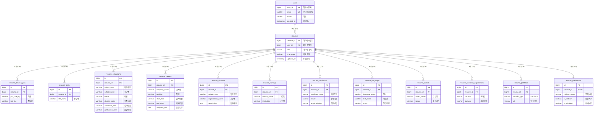

# 📄 User ERD

---

```mermaid
erDiagram
    users ||--o{ resumes : "보유 (1:N)"
    resumes ||--o{ resume_desired_jobs : "포함 (1:N)"
    resumes ||--o{ resume_skills : "포함 (1:N)"
    resumes ||--o{ resume_educations : "포함 (1:N)"
    resumes ||--o{ resume_careers : "포함 (1:N)"
    resumes ||--o{ resume_activities : "포함 (1:N)"
    resumes ||--o{ resume_trainings : "포함 (1:N)"
    resumes ||--o{ resume_certificates : "포함 (1:N)"
    resumes ||--o{ resume_languages : "포함 (1:N)"
    resumes ||--o{ resume_awards : "포함 (1:N)"
    resumes ||--o{ resume_overseas_experiences : "포함 (1:N)"
    resumes ||--o{ resume_portfolios : "포함 (1:N)"
    resumes ||--|| resume_preferences : "설정 (1:1)"

    users {
        bigint user_id PK "회원 식별자"
        varchar email UK "로그인 이메일"
        varchar name "이름"
        timestamp created_at "가입일시"
    }

    resumes {
        bigint resume_id PK "이력서 식별자"
        bigint user_id FK "회원 식별자"
        varchar title "이력서 제목"
        boolean is_primary "대표 여부"
        timestamp updated_at "수정일시"
    }

    resume_desired_jobs {
        bigint id PK
        bigint resume_id FK
        varchar job_category "직종"
        varchar job_title "직무명"
    }

    resume_skills {
        bigint id PK
        bigint resume_id FK
        varchar skill_name "스킬명"
    }

    resume_educations {
        bigint id PK
        bigint resume_id FK
        varchar school_type "학교구분"
        varchar school_name "학교명"
        varchar major "전공"
        varchar degree_status "학적상태"
        varchar admission_date "입학년월"
        varchar graduation_date "졸업년월"
    }

    resume_careers {
        bigint id PK
        bigint resume_id FK
        varchar company_name "회사명"
        varchar position "직급"
        varchar start_date "입사년월"
        varchar end_date "퇴사년월"
        text assigned_task "담당업무"
    }

    resume_activities {
        bigint id PK
        bigint resume_id FK
        varchar activity_type "활동구분"
        varchar organization_name "기관명"
        text description "활동내용"
    }

    resume_trainings {
        bigint id PK
        bigint resume_id FK
        varchar course_name "과정명"
        varchar institution "기관명"
    }

    resume_certificates {
        bigint id PK
        bigint resume_id FK
        varchar certificate_name "자격증명"
        varchar issuer "발행기관"
        varchar acquired_date "취득년월"
    }

    resume_languages {
        bigint id PK
        bigint resume_id FK
        varchar language_name "언어"
        varchar test_name "시험명"
        varchar score "점수/등급"
    }

    resume_awards {
        bigint id PK
        bigint resume_id FK
        varchar award_name "수상명"
        varchar issuer "수여기관"
    }

    resume_overseas_experiences {
        bigint id PK
        bigint resume_id FK
        varchar country "국가명"
        varchar purpose "체류목적"
    }

    resume_portfolios {
        bigint id PK
        bigint resume_id FK
        varchar portfolio_type "URL/FILE"
        varchar url "링크/경로"
    }

    resume_preferences {
        bigint id PK
        bigint resume_id FK, UK
        varchar military_status "병역상태"
        boolean is_veteran "보훈여부"
        boolean is_disabled "장애여부"
    }
```
