# 사용자·선호 도메인

회원 계정과 복수 희망 산업·직무·보유 기술을 관리합니다.

## ERD

```mermaid
erDiagram
    USERS ||--o{ USER_INDUSTRY : "희망 산업 선택"
    INDUSTRY ||--o{ USER_INDUSTRY : "사용자에게 선택됨"
    USERS ||--o{ USER_DESIRED_JOB : "희망 직무 선택"
    JOB_CATEGORY ||--o{ USER_DESIRED_JOB : "사용자에게 선택됨"
    USERS ||--o{ USER_SKILL : "기술 보유"

    USERS {
        bigint user_id PK "사용자 식별자"
        string email UK "로그인 이메일"
        string password_hash "비밀번호 해시"
        string name "사용자 이름"
        datetime created_at "가입 시각"
        datetime updated_at "수정 시각"
    }

    INDUSTRY {
        bigint industry_id PK "산업 식별자"
        string industry_name UK "산업명"
    }

    USER_INDUSTRY {
        bigint user_id PK, FK "사용자"
        bigint industry_id PK, FK "희망 산업"
    }

    JOB_CATEGORY {
        bigint job_category_id PK "직무 식별자"
        string job_name UK "직무명"
    }

    USER_DESIRED_JOB {
        bigint user_id PK, FK "사용자"
        bigint job_category_id PK, FK "희망 직무"
    }

    USER_SKILL {
        bigint user_skill_id PK "보유 기술 식별자"
        bigint user_id FK "사용자"
        string skill_name "기술명"
    }
```

## USERS — 회원 계정

| 컬럼 | 타입 | 제약 | 용도 |
|---|---|---|---|
| `user_id` | BIGINT | PK | 사용자 식별자 |
| `email` | VARCHAR(255) | NOT NULL, UNIQUE | 로그인 이메일 |
| `password_hash` | VARCHAR(255) | NOT NULL | 비밀번호 해시 |
| `name` | VARCHAR(100) | NOT NULL | 사용자 이름 |
| `created_at` | TIMESTAMP | NOT NULL | 가입 시각 |
| `updated_at` | TIMESTAMP | NOT NULL | 수정 시각 |

실제 테이블명은 예약어 충돌을 피하기 위해 `USER`가 아닌 `USERS`를 사용합니다.

## INDUSTRY — 산업 기준 정보

| 컬럼 | 타입 | 제약 | 용도 |
|---|---|---|---|
| `industry_id` | BIGINT | PK | 산업 식별자 |
| `industry_name` | VARCHAR(100) | NOT NULL, UNIQUE | 산업명 |

## USER_INDUSTRY — 사용자 희망 산업

| 컬럼 | 타입 | 제약 | 용도 |
|---|---|---|---|
| `user_id` | BIGINT | PK, FK → USERS | 사용자 |
| `industry_id` | BIGINT | PK, FK → INDUSTRY | 희망 산업 |

한 사용자가 여러 산업을 선택할 수 있는 N:M 연결 테이블입니다.

## JOB_CATEGORY — 직무 기준 정보

| 컬럼 | 타입 | 제약 | 용도 |
|---|---|---|---|
| `job_category_id` | BIGINT | PK | 직무 식별자 |
| `job_name` | VARCHAR(100) | NOT NULL, UNIQUE | 직무명 |

## USER_DESIRED_JOB — 사용자 희망 직무

| 컬럼 | 타입 | 제약 | 용도 |
|---|---|---|---|
| `user_id` | BIGINT | PK, FK → USERS | 사용자 |
| `job_category_id` | BIGINT | PK, FK → JOB_CATEGORY | 희망 직무 |

한 사용자가 여러 직무를 선택할 수 있는 N:M 연결 테이블입니다.

## USER_SKILL — 사용자 보유 기술

| 컬럼 | 타입 | 제약 | 용도 |
|---|---|---|---|
| `user_skill_id` | BIGINT | PK | 보유 기술 식별자 |
| `user_id` | BIGINT | NOT NULL, FK → USERS | 사용자 |
| `skill_name` | VARCHAR(100) | NOT NULL | 기술명 |

고유 제약: `UNIQUE(user_id, skill_name)`

기술은 현재 자유 입력으로 관리합니다. 향후 표준 기술 목록이 필요할 때만 `SKILL` 마스터 테이블로 분리합니다.

## 관리 규칙

- 프로필 API에서 사용자 ID를 요청받지 않고 인증 정보에서 가져옵니다.
- 희망 산업·직무·기술 교체는 하나의 트랜잭션으로 처리합니다.
- 산업·직무 기준 데이터는 시드로 관리하며 사용자 쓰기 API를 제공하지 않습니다.
- 사용자 삭제 시 연결 테이블과 기술을 함께 삭제합니다.
