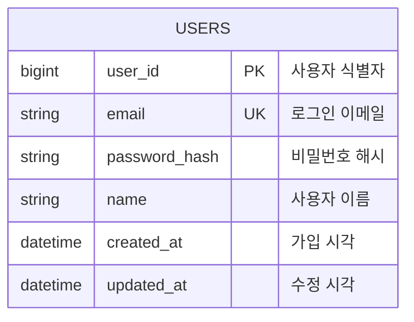

# 사용자 도메인

현재 백엔드에 구현된 데모 사용자 계정 구조를 설명합니다. 희망 산업·희망 직무·보유 기술은 초기 논리 설계에는 있었지만 아직 JPA 엔티티와 API가 구현되지 않았으므로 현재 ERD에서 제외합니다.

## 구현 범위

- 실제 회원가입과 비밀번호 검증은 구현하지 않습니다.
- 로그인 버튼을 누르면 시드로 등록된 고정 사용자 한 명을 반환합니다.
- `USERS.password_hash`는 향후 인증 확장을 위한 컬럼이며 데모 로그인에서는 검증하지 않습니다.
- 경험, 추천 실행, 지원 프로젝트는 모두 이 사용자와 연결됩니다.

## ERD



## USERS — 회원 계정

실제 테이블명은 예약어 충돌을 피하기 위해 `USER`가 아닌 `USERS`를 사용합니다.

| 컬럼 | 타입 | 제약 | 용도 |
|---|---|---|---|
| `user_id` | BIGINT | PK | 사용자 식별자 |
| `email` | VARCHAR(255) | NOT NULL, UNIQUE | 로그인 이메일 |
| `password_hash` | VARCHAR(255) | NOT NULL | 비밀번호 해시. 현재 데모에서는 검증하지 않음 |
| `name` | VARCHAR(100) | NOT NULL | 사용자 이름 |
| `created_at` | TIMESTAMP | NOT NULL | 가입 시각 |
| `updated_at` | TIMESTAMP | NOT NULL | 수정 시각 |

## 다른 도메인과의 관계

| 자식 테이블 | 관계 | 의미 |
|---|---|---|
| `EXPERIENCE` | 1:N | 사용자가 저장한 경험 |
| `RECOMMENDATION_RUN` | 1:N | 사용자가 실행한 맞춤 추천 이력 |
| `JOB_APPLICATION` | 1:N | 사용자가 만든 지원 프로젝트 |

현재 데이터베이스 FK의 삭제 규칙은 모두 `NO ACTION`입니다. 사용자 삭제 API도 구현되어 있지 않으므로 사용자 탈퇴와 연쇄 삭제는 현재 범위에 포함되지 않습니다.

## 아직 구현하지 않은 선호 정보

다음 테이블은 이전 설계안에만 있었고 현재 코드와 PostgreSQL에는 존재하지 않습니다.

```text
INDUSTRY
USER_INDUSTRY
JOB_CATEGORY
USER_DESIRED_JOB
USER_SKILL
```

맞춤 추천은 현재 프로필 선호 정보가 아니라 저장된 `EXPERIENCE_KEYWORD`를 입력으로 사용합니다. 이후 희망 산업·직무·기술 기반 필터링이 실제 요구사항에 포함될 때 위 테이블과 프로필 수정 API를 함께 추가합니다.
