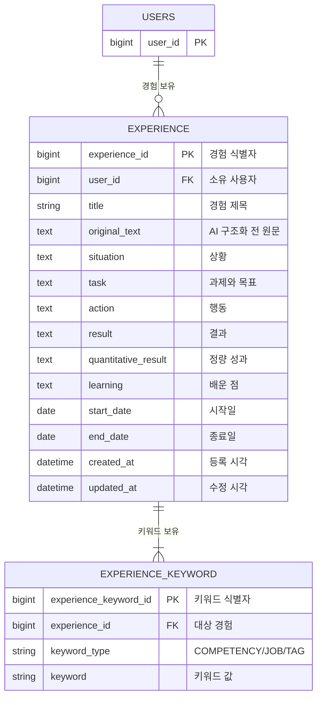

# 경험 도메인

사용자가 입력한 경험을 STAR 구조와 키워드로 저장하고 자기소개서 초안의 재사용 가능한 소재로 관리합니다.

## 현재 동작

1. 자유서술 경험은 구조화 API에서 STAR와 키워드 미리보기로 변환됩니다. 이 단계에서는 DB에 저장하지 않습니다.
2. 사용자가 결과를 확인·수정하고 저장을 요청하면 `EXPERIENCE`와 `EXPERIENCE_KEYWORD`를 함께 저장합니다.
3. 사용자가 STAR 항목을 직접 작성한 경우에도 같은 저장 API와 테이블을 사용합니다.
4. 추천과 초안 생성은 저장된 경험만 사용합니다.

## ERD



## EXPERIENCE — STAR 경험 자산

| 컬럼 | 타입 | 제약 | 용도 |
|---|---|---|---|
| `experience_id` | BIGINT | PK | 경험 식별자 |
| `user_id` | BIGINT | NOT NULL, FK → USERS | 소유 사용자 |
| `title` | VARCHAR(200) | NOT NULL | 경험 제목 |
| `original_text` | TEXT | NULL 허용 | AI 구조화 전 자유서술 원문. 직접 구조화 입력이면 없을 수 있음 |
| `situation` | TEXT | NOT NULL | 상황 |
| `task` | TEXT | NOT NULL | 과제와 목표 |
| `action` | TEXT | NOT NULL | 수행 행동 |
| `result` | TEXT | NOT NULL | 결과 |
| `quantitative_result` | TEXT | NULL 허용 | 수치로 표현한 성과 |
| `learning` | TEXT | NULL 허용 | 경험에서 배운 점 |
| `start_date` | DATE | NULL 허용 | 시작일 |
| `end_date` | DATE | NULL 허용 | 종료일. 진행 중이면 NULL |
| `created_at` | TIMESTAMP | NOT NULL | 등록 시각 |
| `updated_at` | TIMESTAMP | NOT NULL | 수정 시각 |

애플리케이션 검증 규칙:

- 두 날짜가 모두 있으면 `start_date <= end_date`여야 합니다.
- `title`은 200자, `original_text`는 5,000자, 각 STAR 필드는 2,000자를 넘을 수 없습니다.
- 경험 하나에는 1~20개의 키워드가 필요하고, 그중 `COMPETENCY` 또는 `JOB`이 최소 한 개 있어야 합니다.

조회 인덱스:

```text
INDEX idx_experience_user_updated(user_id, updated_at)
```

## EXPERIENCE_KEYWORD — 경험 키워드

| 컬럼 | 타입 | 제약 | 용도 |
|---|---|---|---|
| `experience_keyword_id` | BIGINT | PK | 키워드 식별자 |
| `experience_id` | BIGINT | NOT NULL, FK → EXPERIENCE | 대상 경험 |
| `keyword_type` | VARCHAR(30) | NOT NULL | `COMPETENCY`, `JOB`, `TAG` 중 하나 |
| `keyword` | VARCHAR(100) | NOT NULL | 추천 및 초안 생성에 전달할 키워드 |

고유 제약:

```text
UNIQUE uk_experience_keyword_value(experience_id, keyword_type, keyword)
```

현재 물리 스키마에는 `(keyword_type, keyword)` 검색 인덱스가 없습니다. 키워드 검색 성능이 실제 병목으로 확인될 때 추가합니다.

## 삭제와 스냅샷

- 현재 경험 삭제 API는 구현되어 있지 않습니다.
- JPA에서 `EXPERIENCE`와 `EXPERIENCE_KEYWORD`는 `cascade + orphanRemoval` 관계지만, 데이터베이스 FK 삭제 규칙 자체는 `NO ACTION`입니다.
- 추천 입력과 초안 근거는 각각 `RECOMMENDATION_INPUT_EXPERIENCE`, `DRAFT_EXPERIENCE`에서 원본 경험을 참조합니다. 두 FK 역시 현재 `NO ACTION`이므로 참조 중인 경험을 DB에서 바로 삭제할 수 없습니다.
- 두 스냅샷 컬럼은 실제 PostgreSQL `JSON` 타입이 아니라 JSON 문자열을 저장하는 `TEXT`입니다.
- 향후 경험 삭제 기능을 추가하려면 원본 FK를 먼저 NULL로 바꾸는 서비스 로직 또는 명시적인 `ON DELETE SET NULL` 마이그레이션이 필요합니다.
