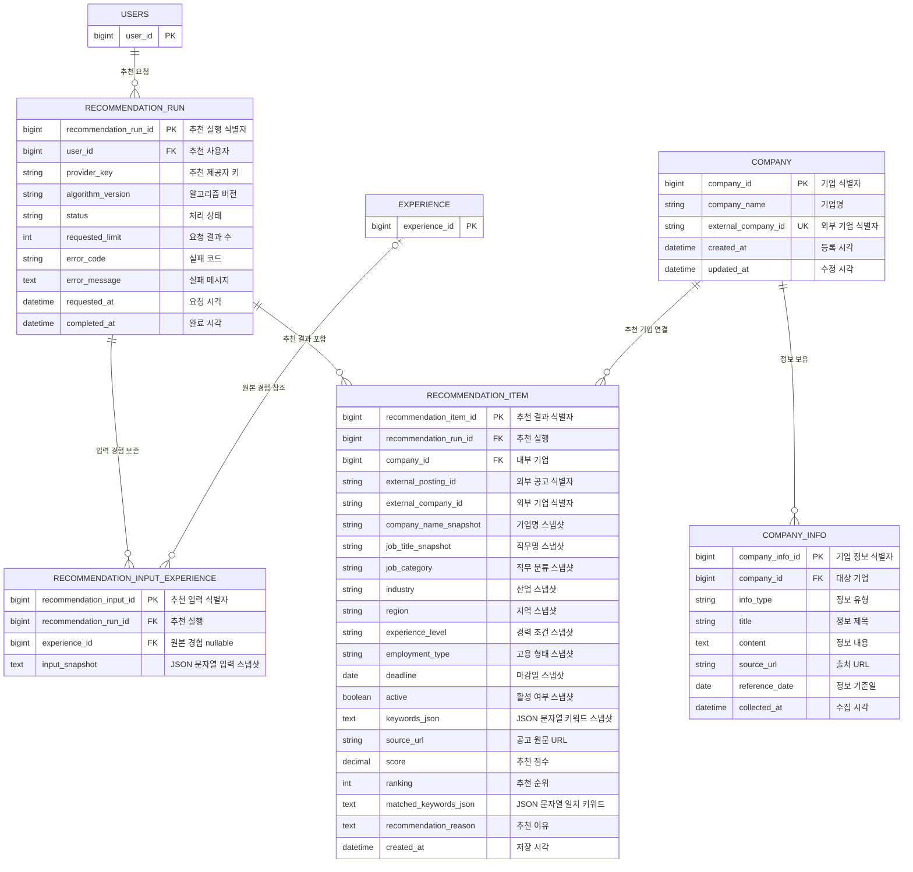

# 기업·추천 도메인

기업 마스터와 유형별 기업 정보를 관리하고, 추천 요청 1회와 그 결과 목록을 분리해 저장합니다. 추천 결과를 만든 구현체는 `provider_key`로 기록하므로 현재 Mock 제공자를 향후 자체 알고리즘이나 제휴 제공자로 교체할 수 있습니다.

이 문서의 타입과 제약조건은 현재 JPA 엔티티가 생성한 PostgreSQL 물리 스키마를 기준으로 합니다. 이름에 `_json` 또는 `_snapshot`이 포함돼도 현재 구현은 JSON 문자열을 `TEXT`에 저장합니다.

## ERD



## COMPANY — 기업 마스터

| 컬럼 | 타입 | 제약 | 용도 |
|---|---|---|---|
| `company_id` | BIGINT | PK | 내부 기업 식별자 |
| `company_name` | VARCHAR(200) | NOT NULL | 기업명 |
| `external_company_id` | VARCHAR(100) | NOT NULL, UNIQUE | 현재 Mock 공고의 기업 식별자 |
| `created_at` | TIMESTAMP | NOT NULL | 등록 시각 |
| `updated_at` | TIMESTAMP | NOT NULL | 수정 시각 |

기업은 정보 수집 여부와 관계없이 존재할 수 있고, 하나의 기업이 여러 `COMPANY_INFO` 항목을 가집니다. 현재는 공고 제공처가 하나라는 가정으로 외부 식별자를 직접 보관합니다. 여러 채용 플랫폼을 동시에 연결할 때는 제공처별 식별자를 관리하는 매핑 테이블이 추가로 필요합니다.

## COMPANY_INFO — 유형별 기업 정보

| 컬럼 | 타입 | 제약 | 용도 |
|---|---|---|---|
| `company_info_id` | BIGINT | PK | 기업 정보 식별자 |
| `company_id` | BIGINT | NOT NULL, FK → COMPANY | 대상 기업 |
| `info_type` | VARCHAR(30) | NOT NULL | 정보 유형 |
| `title` | VARCHAR(300) | NOT NULL | 정보 제목 |
| `content` | TEXT | NOT NULL | 정보 내용 |
| `source_url` | VARCHAR(1000) | NULL 허용 | 출처 URL |
| `reference_date` | DATE | NULL 허용 | 정보 기준일 |
| `collected_at` | TIMESTAMP | NOT NULL | 수집 시각 |

`info_type`:

```text
TALENT_PROFILE
CORE_VALUE
BUSINESS_TREND
INDUSTRY_ISSUE
```

동일 기업에 같은 유형의 정보가 여러 건 존재할 수 있으므로 `(company_id, info_type)` 고유 제약은 두지 않습니다. 애플리케이션에서 `source_url` 또는 `reference_date` 중 하나 이상을 갖도록 검증합니다.

조회 인덱스:

```text
INDEX idx_company_info_company_id(company_id)
```

## RECOMMENDATION_RUN — 추천 실행

추천 버튼을 한 번 누른 요청과 처리 상태를 나타냅니다. 새 추천을 요청해도 이전 결과를 덮어쓰지 않고 새 실행을 만듭니다.

| 컬럼 | 타입 | 제약 | 용도 |
|---|---|---|---|
| `recommendation_run_id` | BIGINT | PK | 추천 실행 식별자 |
| `user_id` | BIGINT | NOT NULL, FK → USERS | 추천 사용자 |
| `provider_key` | VARCHAR(50) | NOT NULL | `mock`, `internal-v1`, `partner-a` 같은 제공자 설정 키 |
| `algorithm_version` | VARCHAR(100) | NULL 허용 | 제공자가 전달한 알고리즘·모델 버전 |
| `status` | VARCHAR(30) | NOT NULL | `PROCESSING`, `COMPLETED`, `FAILED` |
| `requested_limit` | INTEGER | NOT NULL | 요청한 최대 결과 수 |
| `error_code` | VARCHAR(100) | NULL 허용 | 안전한 실패 코드 |
| `error_message` | TEXT | NULL 허용 | 사용자 노출용 실패 메시지 |
| `requested_at` | TIMESTAMP | NOT NULL | 추천 요청 시각 |
| `completed_at` | TIMESTAMP | NULL 허용 | 성공 또는 실패 종료 시각 |

현재 `requested_limit`은 `app.recommendation.result-limit` 설정값을 저장하며 기본값은 10입니다. 완료된 실행만 최신 추천 조회 대상으로 사용합니다.

조회 인덱스:

```text
INDEX idx_recommendation_run_user_requested(user_id, requested_at)
```

## RECOMMENDATION_INPUT_EXPERIENCE — 추천 입력 경험

추천 실행에 어떤 경험과 키워드를 사용했는지 보존합니다.

| 컬럼 | 타입 | 제약 | 용도 |
|---|---|---|---|
| `recommendation_input_id` | BIGINT | PK | 추천 입력 식별자 |
| `recommendation_run_id` | BIGINT | NOT NULL, FK → RECOMMENDATION_RUN | 추천 실행 |
| `experience_id` | BIGINT | NULL, FK → EXPERIENCE | 현재 원본 경험 참조 |
| `input_snapshot` | TEXT | NOT NULL | 해당 추천 제공자에 전달한 경험 입력을 직렬화한 JSON 문자열 |

현재 Mock에는 경험 ID와 키워드만 전달하지만 향후 제공자가 다른 필드를 사용해도 같은 컬럼에 당시 실제 입력을 보존할 수 있습니다. `experience_id`는 nullable이지만 FK 삭제 규칙은 `NO ACTION`이므로 원본 경험 삭제 시 자동으로 NULL이 되지는 않습니다. 고유 제약은 `UNIQUE(recommendation_run_id, experience_id)`입니다.

## RECOMMENDATION_ITEM — 추천 공고 결과

추천 실행 하나에 포함된 공고 한 건입니다. 공고 마스터는 저장하지 않지만, 추천 이력을 다시 표시할 수 있도록 카드 표시에 필요한 값은 스냅샷으로 보존합니다.

| 컬럼 | 타입 | 제약 | 용도 |
|---|---|---|---|
| `recommendation_item_id` | BIGINT | PK | 추천 결과 식별자 |
| `recommendation_run_id` | BIGINT | NOT NULL, FK → RECOMMENDATION_RUN | 소속 추천 실행 |
| `company_id` | BIGINT | NOT NULL, FK → COMPANY | 매핑된 내부 기업 |
| `external_posting_id` | VARCHAR(100) | NOT NULL | 외부 공고 식별자 |
| `external_company_id` | VARCHAR(100) | NOT NULL | 외부 기업 식별자 |
| `company_name_snapshot` | VARCHAR(200) | NOT NULL | 추천 당시 기업명 |
| `job_title_snapshot` | VARCHAR(300) | NOT NULL | 추천 당시 직무명 |
| `job_category` | VARCHAR(100) | NOT NULL | 직무 분류 스냅샷 |
| `industry` | VARCHAR(200) | NOT NULL | 산업 스냅샷 |
| `region` | VARCHAR(200) | NOT NULL | 지역 스냅샷 |
| `experience_level` | VARCHAR(100) | NOT NULL | 경력 조건 스냅샷 |
| `employment_type` | VARCHAR(100) | NOT NULL | 고용 형태 스냅샷 |
| `deadline` | DATE | NOT NULL | 마감일 스냅샷 |
| `active` | BOOLEAN | NOT NULL | 공고 활성 여부 스냅샷 |
| `keywords_json` | TEXT | NOT NULL | 공고 키워드를 직렬화한 JSON 문자열 |
| `source_url` | VARCHAR(1000) | NOT NULL | 공고 원문 URL |
| `score` | DECIMAL(5,2) | NOT NULL | 제공자가 반환한 추천 점수 |
| `ranking` | INTEGER | NOT NULL | 실행 내 추천 순위. Java/API 필드명은 `rank` |
| `matched_keywords_json` | TEXT | NOT NULL | 제공자가 반환한 일치 키워드를 직렬화한 JSON 문자열 |
| `recommendation_reason` | TEXT | NOT NULL | 화면에 표시할 추천 이유 |
| `created_at` | TIMESTAMP | NOT NULL | 저장 시각 |

고유 제약:

```text
UNIQUE uk_recommendation_item_posting(recommendation_run_id, external_posting_id)
UNIQUE uk_recommendation_item_rank(recommendation_run_id, ranking)
```

검증: `rank > 0`, `0 <= score <= 100`. 현재 Mock 카탈로그의 모든 `external_company_id`는 시드 `COMPANY`에 대응해야 합니다. 매핑이 없으면 fixture/설정 오류로 간주해 해당 추천 실행 전체를 `FAILED(COMPANY_MAPPING_NOT_FOUND)`로 종료하며 불완전한 추천 행을 저장하지 않습니다.

## 제공자 교체 경계

DB는 특정 추천 구현체의 응답 형식에 의존하지 않습니다. Spring에서 제공자별 응답을 공통 추천 모델로 변환한 뒤 위 테이블에 저장합니다.

```text
RecommendationProvider
├─ MockRecommendationProvider        현재 구현
├─ InternalRecommendationProvider    향후 자체 추천 로직
└─ PartnerRecommendationProvider     향후 제휴 추천 API

제공자 응답
→ 공통 모델로 변환·검증
→ RECOMMENDATION_RUN / INPUT_EXPERIENCE / ITEM 저장
→ 같은 Spring 응답 계약으로 반환
```

추천 제공자 교체와 공고 카탈로그 제공자 교체는 별개입니다. 이번 범위에서는 교체 추천 제공자도 현재 Mock 공고 카탈로그의 공고·기업 식별자를 반환한다는 계약을 지킵니다. 따라서 `postingProviderKey`나 별도 식별자 매핑 테이블은 두지 않습니다. 공고 카탈로그 자체를 바꿀 때만 식별자 매핑 범위를 다시 설계합니다.

## 데이터 출처와 범위

- 비로그인 전체 공고 목록·상세는 Mock Recruitment Provider API가 제공하며 DB에 공고 마스터로 저장하지 않습니다.
- 저장된 경험이 한 건 이상인 사용자가 추천을 요청하면 추천 실행·입력 경험·결과를 저장합니다.
- 현재 Mock은 실제 점수 계산 없이 고정 결과를 반환하지만 Spring의 저장·조회 계약은 실제 제공자와 동일합니다.
- 추천 상세 화면은 저장된 추천 카드 값과 Mock 공고 상세, 내부 기업 정보를 조합합니다.
- 사용자가 공고를 선택하면 최신 공고 상세를 다시 조회해 `JOB_APPLICATION.posting_snapshot`에 저장합니다.
- 기업과 기업 정보는 `company_seed.json`, `company_info_seed.json`을 읽는 개발용 시드 로직으로 적재합니다.
- 데모에서는 추천 실행과 입력·결과를 모두 보관합니다. 실제 운영 전 최근 N회 또는 기간 기반 만료 정책을 정합니다.

## 현재 삭제 규칙

이 도메인의 모든 데이터베이스 FK는 현재 `NO ACTION`입니다. 삭제 API도 구현되어 있지 않습니다.

- `RECOMMENDATION_RUN`을 삭제하려면 연결된 입력 경험과 추천 결과를 먼저 정리해야 합니다.
- `EXPERIENCE`를 삭제하려면 `RECOMMENDATION_INPUT_EXPERIENCE.experience_id` 참조를 먼저 정리해야 합니다.
- `COMPANY`를 삭제하려면 기업 정보, 추천 결과, 지원 프로젝트 참조를 먼저 정리해야 합니다.
- 과거 이력을 보존하면서 원본만 삭제하려면 이후 마이그레이션에서 nullable FK에 `ON DELETE SET NULL`을 명시해야 합니다.
