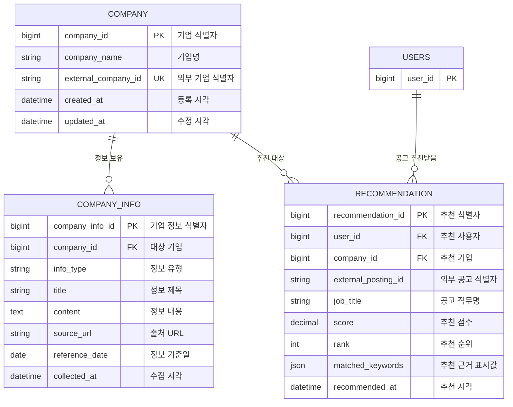

# 기업·추천 도메인

기업 마스터와 유형별 기업 정보를 관리하고, 외부 추천 로직의 결과를 사용자별 목데이터로 저장합니다.

## ERD



## COMPANY — 기업 마스터

| 컬럼 | 타입 | 제약 | 용도 |
|---|---|---|---|
| `company_id` | BIGINT | PK | 내부 기업 식별자 |
| `company_name` | VARCHAR(200) | NOT NULL | 기업명 |
| `external_company_id` | VARCHAR(100) | NOT NULL, UNIQUE | 외부 기업 식별자 |
| `created_at` | TIMESTAMP | NOT NULL | 등록 시각 |
| `updated_at` | TIMESTAMP | NOT NULL | 수정 시각 |

기업은 정보 수집 여부와 관계없이 존재할 수 있고, 하나의 기업이 여러 `COMPANY_INFO` 항목을 가집니다.

## COMPANY_INFO — 유형별 기업 정보

| 컬럼 | 타입 | 제약 | 용도 |
|---|---|---|---|
| `company_info_id` | BIGINT | PK | 기업 정보 식별자 |
| `company_id` | BIGINT | NOT NULL, FK → COMPANY | 대상 기업 |
| `info_type` | VARCHAR(30) | NOT NULL | 정보 유형 |
| `title` | VARCHAR(300) | NOT NULL | 정보 제목 |
| `content` | TEXT | NOT NULL | 정보 내용 |
| `source_url` | VARCHAR(1000) | NULL 허용 | 출처 URL |
| `reference_date` | DATE | NULL 허용 | 정보 기준일 |
| `collected_at` | TIMESTAMP | NOT NULL | 수집 시각 |

`info_type`:

```text
TALENT_PROFILE
CORE_VALUE
BUSINESS_TREND
INDUSTRY_ISSUE
```

동일 기업에 같은 유형의 정보가 여러 건 존재할 수 있으므로 `(company_id, info_type)` 고유 제약은 두지 않습니다. `source_url` 또는 `reference_date` 중 하나 이상을 갖도록 검증합니다.

## RECOMMENDATION — 추천 공고 결과

| 컬럼 | 타입 | 제약 | 용도 |
|---|---|---|---|
| `recommendation_id` | BIGINT | PK | 추천 식별자 |
| `user_id` | BIGINT | NOT NULL, FK → USERS | 추천 사용자 |
| `company_id` | BIGINT | NOT NULL, FK → COMPANY | 추천 기업 |
| `external_posting_id` | VARCHAR(100) | NOT NULL | 외부 공고 식별자 |
| `job_title` | VARCHAR(300) | NOT NULL | 직무명 |
| `score` | DECIMAL(5,2) | NULL 허용 | 목 추천 점수 |
| `rank` | INTEGER | NOT NULL | 사용자별 추천 순위 |
| `matched_keywords` | JSON | NULL 허용 | 화면에 표시할 추천 근거 |
| `recommended_at` | TIMESTAMP | NOT NULL | 추천 시각 |

고유 제약: `UNIQUE(user_id, external_posting_id)`

검증:

```text
rank > 0
score가 있으면 0 <= score <= 100
```

## 데이터 출처와 범위

- 추천 목록은 외부 추천 로직 결과를 목데이터로 적재합니다.
- `matched_keywords`도 목 추천 결과에 포함된 표시용 데이터입니다.
- 공고의 담당 업무·자격요건·문항은 `RECOMMENDATION`에 저장하지 않습니다.
- 추천 상세 조회 시 외부 API 또는 목데이터 어댑터로 공고 상세를 가져옵니다.
- 사용자가 공고를 선택하면 필요한 공고 상세를 `JOB_APPLICATION`에 스냅샷으로 저장합니다.
- 기업과 추천 목데이터는 관리자 API보다 초기 SQL 또는 개발용 시드로 적재합니다.
