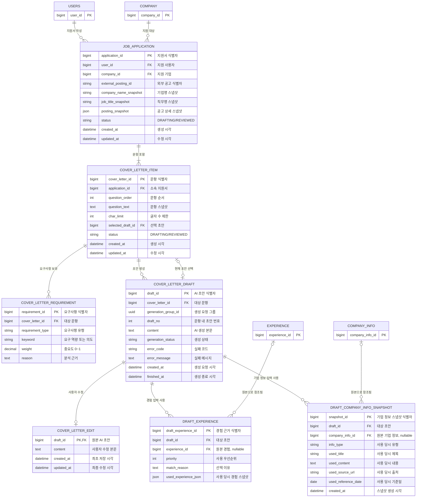

# 지원서·자기소개서 도메인

선택한 공고의 전체 문항을 하나의 지원서로 묶고, 문항 요구사항·AI 초안·사용자 수정본·생성 근거를 관리합니다.

## ERD



## JOB_APPLICATION — 공고별 지원서

| 컬럼 | 타입 | 제약 | 용도 |
|---|---|---|---|
| `application_id` | BIGINT | PK | 지원서 식별자 |
| `user_id` | BIGINT | NOT NULL, FK → USERS | 지원 사용자 |
| `company_id` | BIGINT | NOT NULL, FK → COMPANY | 지원 기업 |
| `external_posting_id` | VARCHAR(100) | NOT NULL | 외부 공고 식별자 |
| `company_name_snapshot` | VARCHAR(200) | NOT NULL | 생성 당시 기업명 |
| `job_title_snapshot` | VARCHAR(300) | NOT NULL | 생성 당시 직무명 |
| `posting_snapshot` | JSON | NOT NULL | 담당 업무·자격요건·우대사항 등의 공고 상세 |
| `status` | VARCHAR(30) | NOT NULL | `DRAFTING`, `REVIEWED` |
| `created_at` | TIMESTAMP | NOT NULL | 생성 시각 |
| `updated_at` | TIMESTAMP | NOT NULL | 수정 시각 |

고유 제약: `UNIQUE(user_id, external_posting_id)`

## COVER_LETTER_ITEM — 자기소개서 문항

| 컬럼 | 타입 | 제약 | 용도 |
|---|---|---|---|
| `cover_letter_id` | BIGINT | PK | 문항 식별자 |
| `application_id` | BIGINT | NOT NULL, FK → JOB_APPLICATION | 소속 지원서 |
| `question_order` | INTEGER | NOT NULL | 문항 순서 |
| `question_text` | TEXT | NOT NULL | 작성 당시 문항 스냅샷 |
| `char_limit` | INTEGER | NULL 허용 | 글자 수 제한 |
| `selected_draft_id` | BIGINT | NULL, FK → COVER_LETTER_DRAFT | 현재 선택 초안 |
| `status` | VARCHAR(30) | NOT NULL | `DRAFTING`, `REVIEWED` |
| `created_at` | TIMESTAMP | NOT NULL | 생성 시각 |
| `updated_at` | TIMESTAMP | NOT NULL | 수정 시각 |

고유 제약: `UNIQUE(application_id, question_order)`

`selected_draft_id`는 초안 삭제 시 SET NULL로 처리하며, 해당 초안이 동일 문항 소속이고 `COMPLETED`인지 서비스에서 검증합니다.

## COVER_LETTER_REQUIREMENT — 문항 분석 결과

| 컬럼 | 타입 | 제약 | 용도 |
|---|---|---|---|
| `requirement_id` | BIGINT | PK | 요구사항 식별자 |
| `cover_letter_id` | BIGINT | NOT NULL, FK → COVER_LETTER_ITEM | 대상 문항 |
| `requirement_type` | VARCHAR(30) | NOT NULL | 요구사항 종류 |
| `keyword` | VARCHAR(100) | NOT NULL | 요구 역량·특성·평가 의도 |
| `weight` | DECIMAL(3,2) | NOT NULL | 중요도 0 이상 1 이하 |
| `reason` | TEXT | NULL 허용 | 분석 근거 |

`requirement_type`: `COMPETENCY`, `JOB`, `TRAIT`, `QUESTION_INTENT`

고유 제약: `UNIQUE(cover_letter_id, requirement_type, keyword)`

첫 초안 생성 또는 전체 생성 계획에서 요구사항이 없는 문항만 최초 분석합니다. 문항은 스냅샷으로 고정되므로 이후 초안에서 재사용하며 현재 범위에는 재분석 API를 두지 않습니다.

## COVER_LETTER_DRAFT — AI 초안

| 컬럼 | 타입 | 제약 | 용도 |
|---|---|---|---|
| `draft_id` | BIGINT | PK | AI 초안 식별자 |
| `cover_letter_id` | BIGINT | NOT NULL, FK → COVER_LETTER_ITEM | 대상 문항 |
| `generation_group_id` | UUID | NOT NULL, INDEX | 단일·전체 생성 요청 그룹 |
| `draft_no` | INTEGER | NOT NULL | 문항 내 초안 번호 |
| `content` | TEXT | NULL 허용 | AI 생성 본문 |
| `generation_status` | VARCHAR(30) | NOT NULL | `PENDING`, `GENERATING`, `COMPLETED`, `FAILED` |
| `error_code` | VARCHAR(100) | NULL 허용 | 안전한 실패 코드 |
| `error_message` | TEXT | NULL 허용 | 사용자 노출용 실패 메시지 |
| `created_at` | TIMESTAMP | NOT NULL | 생성 요청 시각 |
| `finished_at` | TIMESTAMP | NULL 허용 | 성공 또는 실패 종료 시각 |

고유 제약: `UNIQUE(cover_letter_id, draft_no)`

## COVER_LETTER_EDIT — 사용자 최신 수정본

| 컬럼 | 타입 | 제약 | 용도 |
|---|---|---|---|
| `draft_id` | BIGINT | PK, FK → COVER_LETTER_DRAFT | 원본 초안 |
| `content` | TEXT | NOT NULL | 사용자 수정 본문 |
| `created_at` | TIMESTAMP | NOT NULL | 최초 저장 시각 |
| `updated_at` | TIMESTAMP | NOT NULL | 최종 저장 시각 |

초안당 최신 수정본 한 건만 유지하며 재저장 시 같은 행을 갱신합니다.

## DRAFT_EXPERIENCE — 사용 경험과 스냅샷

| 컬럼 | 타입 | 제약 | 용도 |
|---|---|---|---|
| `draft_experience_id` | BIGINT | PK | 경험 근거 식별자 |
| `draft_id` | BIGINT | NOT NULL, FK → COVER_LETTER_DRAFT | 대상 초안 |
| `experience_id` | BIGINT | NULL, FK → EXPERIENCE | 현재 원본 경험 참조 |
| `priority` | INTEGER | NOT NULL | 사용 우선순위 |
| `match_reason` | TEXT | NULL 허용 | 문항 요구사항과 일치한 이유 |
| `used_experience_json` | JSON | NOT NULL | AI 입력 당시 STAR와 키워드 |

고유 제약: `UNIQUE(draft_id, priority)`. 원본이 존재하는 행에는 `UNIQUE(draft_id, experience_id)`를 적용합니다.

경험 삭제 시 `experience_id`만 SET NULL로 바꾸고 스냅샷은 유지합니다.

## DRAFT_COMPANY_INFO_SNAPSHOT — 사용 기업 정보

| 컬럼 | 타입 | 제약 | 용도 |
|---|---|---|---|
| `snapshot_id` | BIGINT | PK | 스냅샷 식별자 |
| `draft_id` | BIGINT | NOT NULL, FK → COVER_LETTER_DRAFT | 대상 초안 |
| `company_info_id` | BIGINT | NULL, FK → COMPANY_INFO | 현재 원본 참조 |
| `info_type` | VARCHAR(30) | NOT NULL | 사용 당시 유형 |
| `used_title` | VARCHAR(300) | NOT NULL | 사용 당시 제목 |
| `used_content` | TEXT | NOT NULL | AI에 제공한 내용 |
| `used_source_url` | VARCHAR(1000) | NULL 허용 | 사용 당시 출처 |
| `used_reference_date` | DATE | NULL 허용 | 사용 당시 기준일 |
| `created_at` | TIMESTAMP | NOT NULL | 스냅샷 생성 시각 |

원본이 존재하는 행에는 `UNIQUE(draft_id, company_info_id)`를 적용합니다. 원본 삭제 시 `company_info_id`만 SET NULL로 바꾸고 스냅샷은 유지합니다.

## 상태 규칙

```text
PENDING → GENERATING → COMPLETED
        ↘ FAILED
PENDING → FAILED
```

- 재시도는 기존 초안을 되돌리지 않고 새 초안을 만듭니다.
- `COMPLETED`에는 `content`, `finished_at`이 필요합니다.
- `FAILED`에는 안전한 `error_code`, `error_message`, `finished_at`을 기록합니다.
- 모든 문항이 `REVIEWED`이면 지원서도 `REVIEWED`, 하나라도 `DRAFTING`이면 지원서도 `DRAFTING`입니다.
