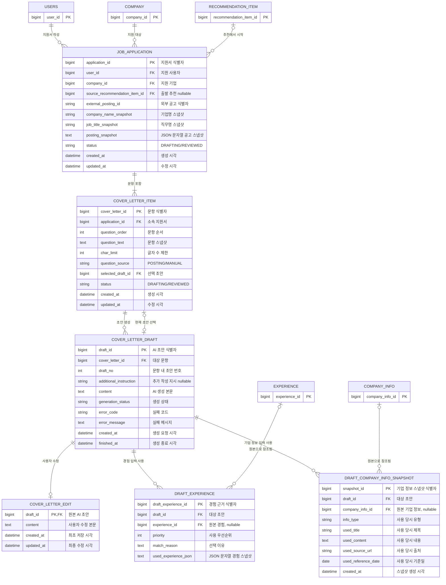

# 지원서·자기소개서 도메인

선택한 공고의 자기소개서 문항을 하나의 지원 프로젝트로 묶고, 문항별 AI 초안·사용자 수정본·생성 근거를 관리합니다. 공고에 문항이 없을 때만 사용자가 직접 입력한 문항을 사용합니다. 같은 사용자가 같은 공고로 여러 프로젝트를 만들 수 있습니다.

이 문서의 컬럼과 제약조건은 현재 JPA 엔티티가 생성한 PostgreSQL 물리 스키마를 기준으로 합니다. 공고와 경험 스냅샷은 JSON 구조이지만 현재 DB에는 JSON 문자열을 `TEXT`로 저장합니다.

## ERD



## JOB_APPLICATION — 공고별 지원서

| 컬럼 | 타입 | 제약 | 용도 |
|---|---|---|---|
| `application_id` | BIGINT | PK | 지원서 식별자 |
| `user_id` | BIGINT | NOT NULL, FK → USERS | 지원 사용자 |
| `company_id` | BIGINT | NOT NULL, FK → COMPANY | 지원 기업 |
| `source_recommendation_item_id` | BIGINT | NULL, FK → RECOMMENDATION_ITEM | 추천 목록에서 시작했을 때 선택한 추천 결과 |
| `external_posting_id` | VARCHAR(100) | NOT NULL | 외부 공고 식별자 |
| `company_name_snapshot` | VARCHAR(200) | NOT NULL | 생성 당시 기업명 |
| `job_title_snapshot` | VARCHAR(300) | NOT NULL | 생성 당시 직무명 |
| `posting_snapshot` | TEXT | NOT NULL | 담당 업무·자격요건·우대사항 등의 공고 상세를 직렬화한 JSON 문자열 |
| `status` | VARCHAR(30) | NOT NULL | `DRAFTING`, `REVIEWED` |
| `created_at` | TIMESTAMP | NOT NULL | 생성 시각 |
| `updated_at` | TIMESTAMP | NOT NULL | 수정 시각 |

동일 공고에 여러 지원 프로젝트를 만들 수 있으므로 `(user_id, external_posting_id)` 고유 제약을 두지 않습니다. 기존 프로젝트 선택 화면을 위한 조회 인덱스는 다음과 같습니다.

```text
INDEX idx_job_application_user_posting_updated(user_id, external_posting_id, updated_at)
```

화면 제목은 별도 컬럼 없이 `company_name_snapshot · job_title_snapshot · created_at`으로 조합합니다.

전체 공고에서 바로 시작한 프로젝트는 `source_recommendation_item_id`가 NULL입니다. 추천 결과에서 시작했다면 해당 결과가 현재 사용자 소유인지와 공고 ID가 일치하는지 검증합니다. 컬럼은 nullable이지만 현재 FK 삭제 규칙은 `NO ACTION`이므로 추천 결과를 삭제해도 자동으로 NULL이 되지는 않습니다.

`posting_snapshot`에는 Mock Recruitment Provider API에서 조회한 기업명·직무·업종·키워드·담당 업무·자격요건·마감일·원문 URL을 저장합니다. 이 정보는 화면에서 조회만 가능하며 사용자 수정값으로 덮어쓰지 않습니다.

## COVER_LETTER_ITEM — 자기소개서 문항

| 컬럼 | 타입 | 제약 | 용도 |
|---|---|---|---|
| `cover_letter_id` | BIGINT | PK | 문항 식별자 |
| `application_id` | BIGINT | NOT NULL, FK → JOB_APPLICATION | 소속 지원서 |
| `question_order` | INTEGER | NOT NULL | 문항 순서 |
| `question_text` | TEXT | NOT NULL | 작성 당시 문항 스냅샷 |
| `char_limit` | INTEGER | NULL 허용 | 글자 수 제한 |
| `question_source` | VARCHAR(20) | NOT NULL | 공고 문항 `POSTING` 또는 직접 입력 `MANUAL` |
| `selected_draft_id` | BIGINT | NULL, FK → COVER_LETTER_DRAFT | 현재 선택 초안 |
| `status` | VARCHAR(30) | NOT NULL | `DRAFTING`, `REVIEWED` |
| `created_at` | TIMESTAMP | NOT NULL | 생성 시각 |
| `updated_at` | TIMESTAMP | NOT NULL | 수정 시각 |

고유 제약:

```text
UNIQUE uk_cover_letter_item_application_order(application_id, question_order)
UNIQUE(selected_draft_id) -- @OneToOne 매핑으로 생성
```

`selected_draft_id`는 해당 문항에서 사용자가 채택한 초안을 가리킵니다. 해당 초안이 동일 문항 소속이고 `COMPLETED`인지 서비스에서 검증합니다. 현재 FK 삭제 규칙은 `NO ACTION`이므로 선택된 초안을 삭제하기 전에 참조를 먼저 해제해야 합니다.

문항 저장 규칙:

```text
Mock 공고에 questions가 존재 → 공고 문항을 스냅샷 저장
Mock 공고에 questions가 없음   → 사용자가 직접 입력한 문항을 스냅샷 저장
```

지원서 생성 시 문항이 최소 한 건 존재하도록 검증하므로 `JOB_APPLICATION`과 `COVER_LETTER_ITEM`의 1:N 관계를 유지합니다. 별도의 문항 사전 분석 테이블은 두지 않습니다. 문항별 초안 생성 요청에서 LLM이 문항 해석·경험 선택·본문 생성을 함께 수행하고, 실제 선택 근거는 `DRAFT_EXPERIENCE`에 저장합니다.

애플리케이션 검증에서 문항 본문은 1~1,000자, `char_limit`은 값이 있다면 1~5,000으로 제한합니다.

## COVER_LETTER_DRAFT — AI 초안

| 컬럼 | 타입 | 제약 | 용도 |
|---|---|---|---|
| `draft_id` | BIGINT | PK | AI 초안 식별자 |
| `cover_letter_id` | BIGINT | NOT NULL, FK → COVER_LETTER_ITEM | 대상 문항 |
| `draft_no` | INTEGER | NOT NULL | 문항 내 초안 번호 |
| `additional_instruction` | VARCHAR(500) | NULL 허용 | 생성 요청 시 사용자가 전달한 추가 작성 지시 |
| `content` | TEXT | NULL 허용 | AI 생성 본문 |
| `generation_status` | VARCHAR(30) | NOT NULL | `PENDING`, `GENERATING`, `COMPLETED`, `FAILED` |
| `error_code` | VARCHAR(100) | NULL 허용 | 안전한 실패 코드 |
| `error_message` | TEXT | NULL 허용 | 사용자 노출용 실패 메시지 |
| `created_at` | TIMESTAMP | NOT NULL | 생성 요청 시각 |
| `finished_at` | TIMESTAMP | NULL 허용 | 성공 또는 실패 종료 시각 |

고유 제약: `UNIQUE(cover_letter_id, draft_no)`

같은 문항에 `PENDING` 또는 `GENERATING` 초안이 있으면 새 요청을 거절합니다. 서로 다른 문항은 동시에 생성할 수 있습니다. 이 경쟁 조건은 문항 잠금과 서비스 로직으로 제어하며 별도의 DB 고유 제약은 없습니다.

## COVER_LETTER_EDIT — 사용자 최신 수정본

| 컬럼 | 타입 | 제약 | 용도 |
|---|---|---|---|
| `draft_id` | BIGINT | PK, FK → COVER_LETTER_DRAFT | 원본 초안 |
| `content` | TEXT | NOT NULL | 사용자 수정 본문 |
| `created_at` | TIMESTAMP | NOT NULL | 최초 저장 시각 |
| `updated_at` | TIMESTAMP | NOT NULL | 최종 저장 시각 |

초안당 최신 수정본 한 건만 유지하며 재저장 시 같은 행을 갱신합니다.

## DRAFT_EXPERIENCE — 사용 경험과 스냅샷

| 컬럼 | 타입 | 제약 | 용도 |
|---|---|---|---|
| `draft_experience_id` | BIGINT | PK | 경험 근거 식별자 |
| `draft_id` | BIGINT | NOT NULL, FK → COVER_LETTER_DRAFT | 대상 초안 |
| `experience_id` | BIGINT | NULL, FK → EXPERIENCE | 현재 원본 경험 참조 |
| `priority` | INTEGER | NOT NULL | 사용 우선순위 |
| `match_reason` | TEXT | NULL 허용 | 문항 요구사항과 일치한 이유 |
| `used_experience_json` | TEXT | NOT NULL | AI 입력 당시 STAR와 키워드를 직렬화한 JSON 문자열 |

고유 제약: `UNIQUE(draft_id, priority)`. 원본이 존재하는 행에는 `UNIQUE(draft_id, experience_id)`를 적용합니다.

`experience_id` 컬럼은 nullable이지만 현재 생성 로직은 항상 존재하는 사용자 경험을 연결합니다. FK 삭제 규칙은 `NO ACTION`이므로 경험을 삭제해도 자동으로 NULL이 되지 않습니다.

## DRAFT_COMPANY_INFO_SNAPSHOT — 사용 기업 정보

| 컬럼 | 타입 | 제약 | 용도 |
|---|---|---|---|
| `snapshot_id` | BIGINT | PK | 스냅샷 식별자 |
| `draft_id` | BIGINT | NOT NULL, FK → COVER_LETTER_DRAFT | 대상 초안 |
| `company_info_id` | BIGINT | NULL, FK → COMPANY_INFO | 현재 원본 참조 |
| `info_type` | VARCHAR(30) | NOT NULL | 사용 당시 유형 |
| `used_title` | VARCHAR(300) | NOT NULL | 사용 당시 제목 |
| `used_content` | TEXT | NOT NULL | AI에 제공한 내용 |
| `used_source_url` | VARCHAR(1000) | NULL 허용 | 사용 당시 출처 |
| `used_reference_date` | DATE | NULL 허용 | 사용 당시 기준일 |
| `created_at` | TIMESTAMP | NOT NULL | 스냅샷 생성 시각 |

고유 제약은 `UNIQUE(draft_id, company_info_id)`입니다. `company_info_id` 컬럼은 nullable이지만 현재 생성 로직은 항상 존재하는 기업 정보를 연결하며, FK 삭제 규칙은 `NO ACTION`입니다.

## 상태 규칙

```text
PENDING → GENERATING → COMPLETED
        ↘ FAILED
PENDING → FAILED
```

- 재시도는 기존 초안을 되돌리지 않고 새 초안을 만듭니다.
- `COMPLETED`에는 `content`, `finished_at`이 필요합니다.
- `FAILED`에는 안전한 `error_code`, `error_message`, `finished_at`을 기록합니다.
- 첫 번째로 완료된 초안은 자동 선택되고, 이후 초안은 사용자가 명시적으로 선택할 수 있습니다.
- 모든 문항이 `REVIEWED`이면 지원서도 `REVIEWED`, 하나라도 `DRAFTING`이면 지원서도 `DRAFTING`입니다.

## 현재 삭제 규칙

현재 삭제 API는 없고 모든 데이터베이스 FK는 `NO ACTION`입니다. JPA 컬렉션에 설정된 `cascade + orphanRemoval`은 애플리케이션이 부모 엔티티를 정상적으로 제거할 때 자식 제거를 돕지만, DB의 `ON DELETE CASCADE`를 의미하지는 않습니다.

특히 과거 생성 근거를 보존하면서 경험·기업 정보·추천 결과를 삭제하려면 nullable 원본 FK를 먼저 NULL로 바꾸는 서비스 로직 또는 명시적인 `ON DELETE SET NULL` 마이그레이션이 필요합니다.
