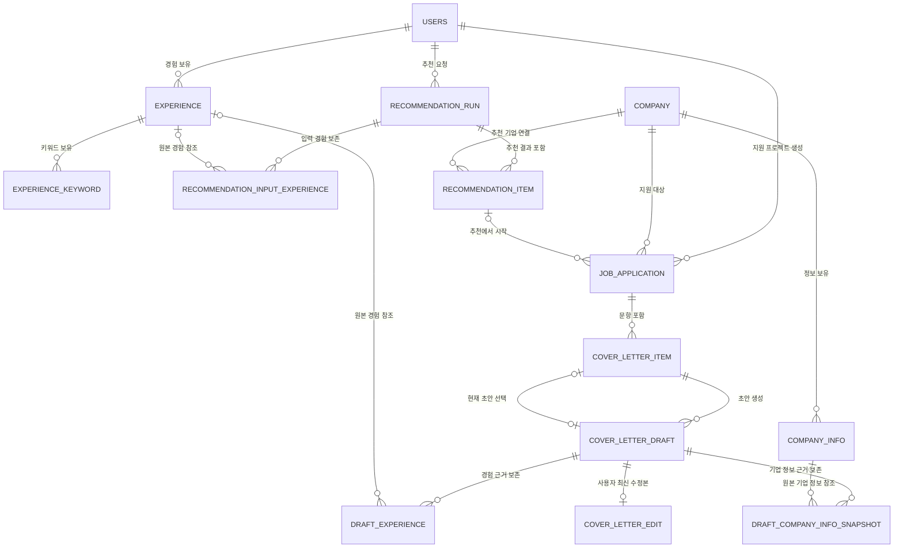

# 데이터베이스 설계 개요

현재 Spring JPA 엔티티와 실행 중인 PostgreSQL 스키마를 기준으로 정리한 ERD입니다. 상세 컬럼과 도메인 규칙은 각 도메인 문서를 기준으로 합니다.

## 문서를 읽을 때 알아둘 점

- 현재 스키마는 마이그레이션 파일이 아니라 `spring.jpa.hibernate.ddl-auto=update`로 생성·갱신됩니다.
- 실제 구현 테이블은 총 15개입니다.
- 컬럼명이 `_json` 또는 `_snapshot`으로 끝나더라도 현재 JSON 스냅샷은 PostgreSQL `JSON/JSONB`가 아닌 `TEXT`에 문자열로 저장됩니다.
- JPA의 `cascade`와 데이터베이스의 `ON DELETE`는 다릅니다. 현재 모든 물리 FK 삭제 규칙은 `NO ACTION`입니다.
- 희망 산업·희망 직무·보유 기술 프로필 테이블은 아직 구현되지 않았습니다.

## 현재 설계 가정

1. 비로그인 전체 공고 목록·상세는 별도 Mock Recruitment Provider API가 제공합니다.
2. 공고 마스터는 DB에 저장하지 않습니다. 지원 프로젝트 생성 시 공고 상세를 `JOB_APPLICATION.posting_snapshot`에 보존합니다.
3. 기업과 유형별 기업 정보는 Spring 시드 로직이 JSON 리소스를 읽어 적재합니다.
4. 저장된 경험이 있는 사용자가 추천을 요청하면 추천 실행, 입력 경험 스냅샷, 결과 공고를 DB에 저장합니다.
5. 추천 구현체는 `RecommendationProvider` 인터페이스 뒤에서 교체할 수 있으며 현재 구현체는 Mock 제공자입니다.
6. 같은 사용자가 같은 공고로 여러 지원 프로젝트를 만들 수 있습니다.
7. 공고에 자기소개서 문항이 있으면 해당 문항을 사용하고, 없을 때만 사용자가 직접 입력합니다.
8. 초안은 문항별로 생성하며 새 요청은 기존 초안을 덮어쓰지 않습니다.
9. 같은 문항의 생성 요청은 한 번에 하나만 처리하지만 서로 다른 문항은 동시에 처리할 수 있습니다.
10. 생성 당시 경험과 기업 정보는 초안별 스냅샷으로 보존합니다.
11. 별도 문항 사전 분석과 전체 문항 일괄 생성은 현재 범위에서 제외합니다.
12. 로그인은 시드 사용자를 반환하는 데모 동작이며 실제 인증은 구현하지 않습니다.

## 도메인 문서

- [사용자 도메인](01_user_profile.md)
- [경험 도메인](02_experience.md)
- [기업·추천 도메인](03_company_recommendation.md)
- [지원서·자기소개서 도메인](04_application_cover_letter.md)

## 전체 관계 ERD



## 테이블 역할 요약

| 도메인 | 테이블 | 역할 |
|---|---|---|
| 사용자 | `USERS` | 데모 사용자 계정 |
| 경험 | `EXPERIENCE` | STAR 구조 경험 본문 |
| 경험 | `EXPERIENCE_KEYWORD` | 경험별 역량·직무·태그 키워드 |
| 기업 | `COMPANY` | 외부 기업 ID를 내부 기업으로 매핑하는 마스터 |
| 기업 | `COMPANY_INFO` | 인재상·핵심가치·사업 동향·업계 이슈 |
| 추천 | `RECOMMENDATION_RUN` | 추천 요청 1회와 처리 결과 |
| 추천 | `RECOMMENDATION_INPUT_EXPERIENCE` | 추천 시 사용한 경험 입력 스냅샷 |
| 추천 | `RECOMMENDATION_ITEM` | 추천 실행에 포함된 공고 결과 스냅샷 |
| 지원 | `JOB_APPLICATION` | 선택 공고별 지원 프로젝트 |
| 지원 | `COVER_LETTER_ITEM` | 지원 프로젝트의 자기소개서 문항 |
| 초안 | `COVER_LETTER_DRAFT` | 문항별 비동기 AI 초안과 생성 상태 |
| 초안 | `COVER_LETTER_EDIT` | AI 초안별 사용자 최신 수정본 |
| 초안 | `DRAFT_EXPERIENCE` | 초안에 실제 사용된 경험과 스냅샷 |
| 초안 | `DRAFT_COMPANY_INFO_SNAPSHOT` | 초안에 실제 사용된 기업 정보 스냅샷 |
| AI 운영 | `LLM_CALL_LOG` | 호출 시도별 모델·토큰·지연·오류 메타데이터 |

## 실제 FK 관계와 삭제 규칙

| 부모 | 자식 | 관계 | 현재 DB 삭제 규칙 |
|---|---|---|---|
| `USERS` | `EXPERIENCE` | 1:N | `NO ACTION` |
| `USERS` | `RECOMMENDATION_RUN` | 1:N | `NO ACTION` |
| `USERS` | `JOB_APPLICATION` | 1:N | `NO ACTION` |
| `EXPERIENCE` | `EXPERIENCE_KEYWORD` | 1:N | `NO ACTION` |
| `COMPANY` | `COMPANY_INFO` | 1:N | `NO ACTION` |
| `RECOMMENDATION_RUN` | `RECOMMENDATION_INPUT_EXPERIENCE` | 1:N | `NO ACTION` |
| `EXPERIENCE` | `RECOMMENDATION_INPUT_EXPERIENCE` | 1:N, 원본 FK nullable | `NO ACTION` |
| `RECOMMENDATION_RUN` | `RECOMMENDATION_ITEM` | 1:N | `NO ACTION` |
| `COMPANY` | `RECOMMENDATION_ITEM` | 1:N | `NO ACTION` |
| `RECOMMENDATION_ITEM` | `JOB_APPLICATION` | 1:N, 출발 추천 FK nullable | `NO ACTION` |
| `COMPANY` | `JOB_APPLICATION` | 1:N | `NO ACTION` |
| `JOB_APPLICATION` | `COVER_LETTER_ITEM` | 1:N | `NO ACTION` |
| `COVER_LETTER_ITEM` | `COVER_LETTER_DRAFT` | 1:N | `NO ACTION` |
| `COVER_LETTER_DRAFT` | `COVER_LETTER_EDIT` | 1:0..1 | `NO ACTION` |
| `COVER_LETTER_DRAFT` | `DRAFT_EXPERIENCE` | 1:N | `NO ACTION` |
| `EXPERIENCE` | `DRAFT_EXPERIENCE` | 1:N, 원본 FK nullable | `NO ACTION` |
| `COVER_LETTER_DRAFT` | `DRAFT_COMPANY_INFO_SNAPSHOT` | 1:N | `NO ACTION` |
| `COMPANY_INFO` | `DRAFT_COMPANY_INFO_SNAPSHOT` | 1:N, 원본 FK nullable | `NO ACTION` |
| `COVER_LETTER_DRAFT` | `COVER_LETTER_ITEM.selected_draft_id` | 1:0..1 | `NO ACTION` |

`EXPERIENCE → EXPERIENCE_KEYWORD`, `JOB_APPLICATION → COVER_LETTER_ITEM`, `COVER_LETTER_DRAFT → COVER_LETTER_EDIT/DRAFT_EXPERIENCE/DRAFT_COMPANY_INFO_SNAPSHOT`에는 JPA `cascade + orphanRemoval`이 설정되어 있습니다. 이는 ORM을 통한 부모 삭제 동작이며 DB의 연쇄 삭제 제약은 아닙니다.

## 고유 제약

```text
USERS(email)
EXPERIENCE_KEYWORD(experience_id, keyword_type, keyword)
COMPANY(external_company_id)
RECOMMENDATION_INPUT_EXPERIENCE(recommendation_run_id, experience_id)
RECOMMENDATION_ITEM(recommendation_run_id, external_posting_id)
RECOMMENDATION_ITEM(recommendation_run_id, ranking)
COVER_LETTER_ITEM(application_id, question_order)
COVER_LETTER_ITEM(selected_draft_id)
COVER_LETTER_DRAFT(cover_letter_id, draft_no)
COVER_LETTER_EDIT(draft_id) -- PK이자 COVER_LETTER_DRAFT FK
DRAFT_EXPERIENCE(draft_id, priority)
DRAFT_EXPERIENCE(draft_id, experience_id)
DRAFT_COMPANY_INFO_SNAPSHOT(draft_id, company_info_id)
```

## 일반 인덱스

PK·UNIQUE가 자동 생성하는 인덱스를 제외한 명시적 인덱스입니다.

```text
INDEX idx_experience_user_updated(user_id, updated_at)
INDEX idx_company_info_company_id(company_id)
INDEX idx_recommendation_run_user_requested(user_id, requested_at)
INDEX idx_job_application_user_posting_updated(user_id, external_posting_id, updated_at)
INDEX idx_llm_call_log_reference(operation_type, reference_id, created_at)
```

## dbdiagram.io 가져오기

현재 물리 스키마는 15개 JPA 엔티티와 `ddl-auto` 설정으로 생성합니다. 별도의 수동 DDL 파일은 아직 제공하지 않습니다.

## 선택 초안 무결성

`COVER_LETTER_ITEM.selected_draft_id`는 조회 시 현재 채택된 초안을 바로 찾기 위한 참조입니다.

- `@OneToOne` 매핑으로 `selected_draft_id`에 UNIQUE 제약이 생성됩니다.
- 선택 초안은 반드시 같은 문항 소속이고 `COMPLETED` 상태여야 하며 서비스 계층에서 검증합니다.
- 첫 번째 완료 초안은 자동 선택됩니다. 이후 초안을 만들면 사용자가 선택 API로 변경합니다.
- 현재 FK는 `NO ACTION`이므로 선택된 초안을 삭제하려면 참조를 먼저 해제해야 합니다.

## 구현되지 않은 설계

초기 문서에 있던 `INDUSTRY`, `USER_INDUSTRY`, `JOB_CATEGORY`, `USER_DESIRED_JOB`, `USER_SKILL`은 현재 엔티티·테이블·API가 없습니다. 프로필 선호 기반 추천을 구현할 때 별도 기능 단위로 추가합니다.

삭제 API, 보관 기간 정책, `ON DELETE CASCADE/SET NULL`, Flyway 또는 Liquibase 마이그레이션도 현재 범위에 포함되지 않습니다.
