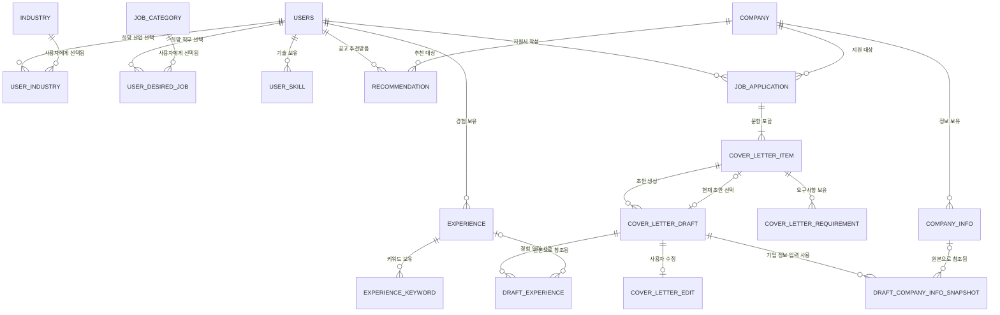

# 데이터베이스 설계 개요

전체 데이터 모델의 관계와 도메인별 상세 문서 링크를 제공합니다. 컬럼의 상세 정의는 각 도메인 문서를 기준으로 합니다.

## 설계 가정

1. 비로그인 전체 공고 목록·상세는 별도 Mock Recruitment Provider API가 제공합니다.
2. 저장된 경험이 있는 로그인 사용자가 추천 생성을 요청하면 사용자별 목 추천 결과를 `RECOMMENDATION`에 저장합니다.
3. 공고 원문은 마스터 테이블로 저장하지 않고, Mock Recruitment Provider에서 조회한 뒤 지원서 생성 시 `JOB_APPLICATION.posting_snapshot`에 보존합니다.
4. 기업 정보는 `COMPANY_INFO`에 유형별 항목으로 저장합니다.
5. `COMPANY_KEYWORD`, `JOB_POSTING`, `AI_JOB`은 현재 범위에 없습니다.
6. 사용자당 동일 외부 공고의 지원서는 한 건만 허용합니다.
7. 문항 요구사항은 `COVER_LETTER_REQUIREMENT`에 최초 분석 결과를 저장하고 재사용합니다.
8. 생성 당시 경험과 기업 정보는 초안별 스냅샷으로 보존합니다.
9. 공고에 자기소개서 문항이 있으면 해당 문항을 사용하고, 없을 때만 사용자가 입력한 문항을 저장합니다.
10. 로그인은 시드 사용자를 반환하는 데모 동작이며 실제 인증은 구현하지 않습니다.

## 도메인 문서

- [사용자·선호 도메인](01_user_profile.md)
- [경험 도메인](02_experience.md)
- [기업·추천 도메인](03_company_recommendation.md)
- [지원서·자기소개서 도메인](04_application_cover_letter.md)

## 전체 관계 ERD



## 도메인 간 관계

| 부모 | 자식 | 관계 | 삭제 정책 |
|---|---|---|---|
| `USERS` | `EXPERIENCE` | 1:N | 사용자 삭제 시 CASCADE |
| `USERS` | `RECOMMENDATION` | 1:N | 사용자 삭제 시 CASCADE |
| `USERS` | `JOB_APPLICATION` | 1:N | 사용자 삭제 시 CASCADE |
| `COMPANY` | `COMPANY_INFO` | 1:N | 운영 정책상 삭제 제한 권장 |
| `COMPANY` | `RECOMMENDATION` | 1:N | 참조 중 삭제 제한 |
| `COMPANY` | `JOB_APPLICATION` | 1:N | 참조 중 삭제 제한 |
| `JOB_APPLICATION` | `COVER_LETTER_ITEM` | 1:N | 지원서 삭제 시 CASCADE |
| `COVER_LETTER_ITEM` | `COVER_LETTER_DRAFT` | 1:N | 문항 삭제 시 CASCADE |
| `EXPERIENCE` | `DRAFT_EXPERIENCE` | 1:N | 경험 삭제 시 FK만 SET NULL, 스냅샷 유지 |
| `COMPANY_INFO` | `DRAFT_COMPANY_INFO_SNAPSHOT` | 1:N | 원본 삭제 시 FK만 SET NULL, 스냅샷 유지 |

## 핵심 고유 제약

```text
USERS(email)
USER_INDUSTRY(user_id, industry_id)
USER_DESIRED_JOB(user_id, job_category_id)
USER_SKILL(user_id, skill_name)
EXPERIENCE_KEYWORD(experience_id, keyword_type, keyword)
COMPANY(external_company_id)
RECOMMENDATION(user_id, external_posting_id)
JOB_APPLICATION(user_id, external_posting_id)
COVER_LETTER_ITEM(application_id, question_order)
COVER_LETTER_REQUIREMENT(cover_letter_id, requirement_type, keyword)
COVER_LETTER_DRAFT(cover_letter_id, draft_no)
DRAFT_EXPERIENCE(draft_id, priority)
```

## 선택 초안 무결성

`COVER_LETTER_ITEM.selected_draft_id`는 조회 편의를 위한 참조입니다.

- 초안 삭제 시 `ON DELETE SET NULL`을 적용합니다.
- 선택 초안은 반드시 같은 문항 소속이고 `COMPLETED` 상태여야 합니다.
- 동일 문항 소속 여부는 서비스 계층에서 추가 검증합니다.
