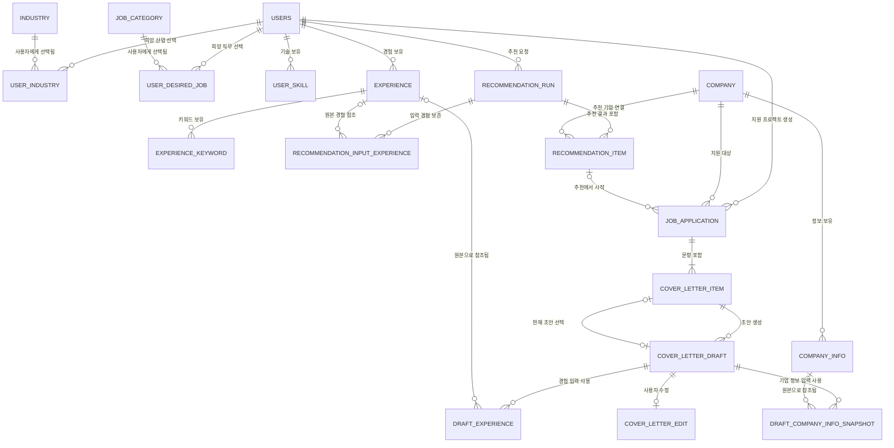

# 데이터베이스 설계 개요

전체 데이터 모델의 관계와 도메인별 상세 문서 링크를 제공합니다. 컬럼의 상세 정의는 각 도메인 문서를 기준으로 합니다.

## 설계 가정

1. 비로그인 전체 공고 목록·상세는 별도 Mock Recruitment Provider API가 제공합니다.
2. 저장된 경험이 있는 사용자가 추천을 요청하면 추천 실행, 입력 경험, 결과 공고를 PostgreSQL에 저장합니다.
3. 추천 구현체는 Spring 인터페이스 뒤에 두고 설정으로 교체합니다. 현재 구현체는 Mock 제공자입니다.
4. 공고 원문은 마스터 테이블로 저장하지 않고, 지원 프로젝트 생성 시 `JOB_APPLICATION.posting_snapshot`에 보존합니다.
5. 기업 정보는 `COMPANY_INFO`에 유형별 항목으로 저장합니다.
6. 같은 사용자가 같은 공고로 여러 지원 프로젝트를 만들 수 있습니다.
7. 공고에 자기소개서 문항이 있으면 해당 문항을 사용하고, 없을 때만 사용자가 직접 입력합니다.
8. 초안은 문항별로 한 건씩 생성하며 새 요청은 기존 초안을 덮어쓰지 않습니다.
9. 별도 문항 사전 분석과 전체 문항 일괄 생성은 현재 범위에서 제외합니다.
10. 생성 당시 경험과 기업 정보는 초안별 스냅샷으로 보존합니다.
11. 로그인은 시드 사용자를 반환하는 데모 동작이며 실제 인증은 구현하지 않습니다.

## 도메인 문서

- [사용자·선호 도메인](01_user_profile.md)
- [경험 도메인](02_experience.md)
- [기업·추천 도메인](03_company_recommendation.md)
- [지원서·자기소개서 도메인](04_application_cover_letter.md)

## 전체 관계 ERD



## 도메인 간 관계

아래 삭제 정책은 목표 정책입니다. 현재 데모에는 삭제 API와 명시적 `ON DELETE` 마이그레이션이 없으므로, 실제 삭제 기능을 추가할 때 함께 적용해야 합니다.

| 부모 | 자식 | 관계 | 삭제 정책 |
|---|---|---|---|
| `USERS` | `EXPERIENCE` | 1:N | 사용자 삭제 시 CASCADE |
| `USERS` | `RECOMMENDATION_RUN` | 1:N | 사용자 삭제 시 CASCADE |
| `RECOMMENDATION_RUN` | `RECOMMENDATION_INPUT_EXPERIENCE` | 1:N | 실행 삭제 시 CASCADE |
| `RECOMMENDATION_RUN` | `RECOMMENDATION_ITEM` | 1:N | 실행 삭제 시 CASCADE |
| `EXPERIENCE` | `RECOMMENDATION_INPUT_EXPERIENCE` | 1:N | 경험 삭제 시 FK만 SET NULL, 제공자 입력 스냅샷 유지 |
| `COMPANY` | `COMPANY_INFO` | 1:N | 운영 정책상 삭제 제한 권장 |
| `COMPANY` | `RECOMMENDATION_ITEM` | 1:N | 현재 Mock 카탈로그에서는 매핑 필수, 참조 중 삭제 제한 |
| `RECOMMENDATION_ITEM` | `JOB_APPLICATION` | 1:N | 추천 결과 삭제 시 FK만 SET NULL, 프로젝트 유지 |
| `USERS` | `JOB_APPLICATION` | 1:N | 사용자 삭제 시 CASCADE |
| `COMPANY` | `JOB_APPLICATION` | 1:N | 참조 중 삭제 제한 |
| `JOB_APPLICATION` | `COVER_LETTER_ITEM` | 1:N | 프로젝트 삭제 시 CASCADE |
| `COVER_LETTER_ITEM` | `COVER_LETTER_DRAFT` | 1:N | 문항 삭제 시 CASCADE |
| `EXPERIENCE` | `DRAFT_EXPERIENCE` | 1:N | 경험 삭제 시 FK만 SET NULL, 스냅샷 유지 |
| `COMPANY_INFO` | `DRAFT_COMPANY_INFO_SNAPSHOT` | 1:N | 원본 삭제 시 FK만 SET NULL, 스냅샷 유지 |

## 핵심 고유 제약과 인덱스

```text
USERS(email)
USER_INDUSTRY(user_id, industry_id)
USER_DESIRED_JOB(user_id, job_category_id)
USER_SKILL(user_id, skill_name)
EXPERIENCE_KEYWORD(experience_id, keyword_type, keyword)
COMPANY(external_company_id)
RECOMMENDATION_INPUT_EXPERIENCE(recommendation_run_id, experience_id) -- 원본이 있을 때
RECOMMENDATION_ITEM(recommendation_run_id, external_posting_id)
RECOMMENDATION_ITEM(recommendation_run_id, rank)
COVER_LETTER_ITEM(application_id, question_order)
COVER_LETTER_DRAFT(cover_letter_id, draft_no)
DRAFT_EXPERIENCE(draft_id, priority)

INDEX RECOMMENDATION_RUN(user_id, requested_at DESC)
INDEX JOB_APPLICATION(user_id, external_posting_id, created_at DESC)
```

`JOB_APPLICATION(user_id, external_posting_id)`는 고유 제약이 아닙니다. 사용자가 같은 공고를 다시 선택하면 프론트엔드는 기존 프로젝트 목록을 보여주고, 사용자가 기존 프로젝트로 이동하거나 새 프로젝트를 생성합니다.

## 선택 초안 무결성

`COVER_LETTER_ITEM.selected_draft_id`는 조회 편의를 위한 참조입니다.

- 초안 삭제 시 `ON DELETE SET NULL`을 적용합니다.
- 선택 초안은 반드시 같은 문항 소속이고 `COMPLETED` 상태여야 합니다.
- 동일 문항 소속 여부는 서비스 계층에서 추가 검증합니다.
